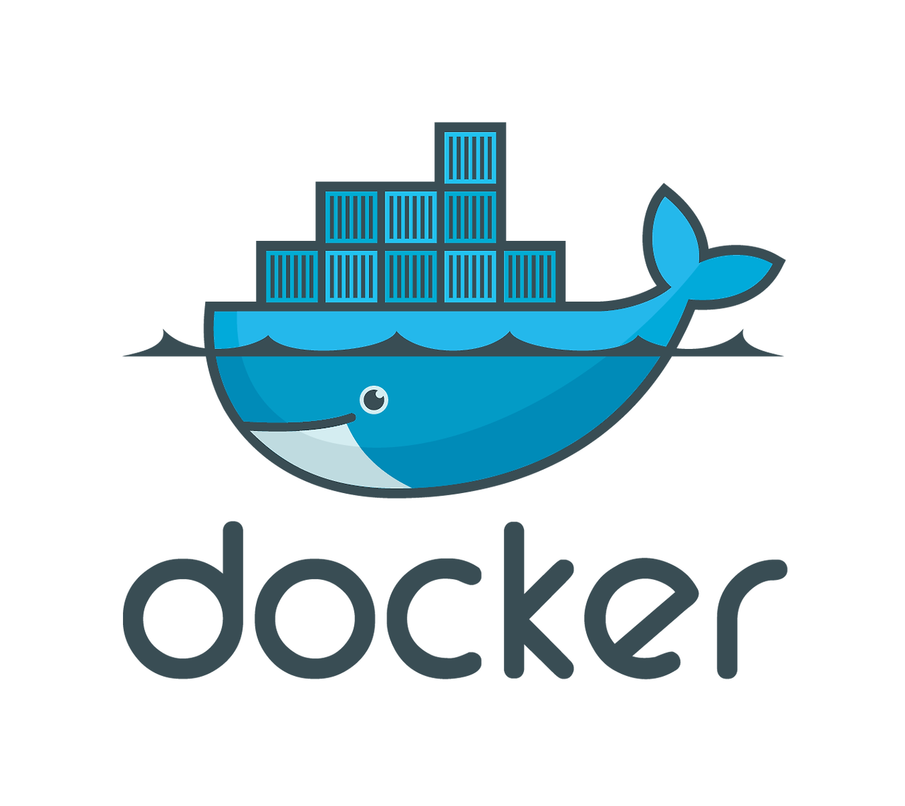

### 왜 `Docker`를 도입했는가?
> 가령 백엔드, 프론트 개발자가 협업을 하고 있다고 하자.
> 개발자 입장에서 협업을 위해 동료 개발자의 `PC`에 `JDK`, `IDE`, `DB` 등을 직접 설치해야 한다면 얼마나 번거로운가. 단순히 버전을 맞추는 것만 해도 번거롭고 귀찮은 업무가 되어 버린다. 
> 그냥 개발 환경 자체를 전달할 수만 있다면 정말 편하지 않을까?
> 이때 필요한 것이 도커 컨테이너 기술이다.
> 
> 필자도 로컬 환경에서 프로젝트 실행 후 `React`를 통해 프론트엔드를 개발하면서, 백엔드의 소스 코드나 `DB`등의 리소스를 관리하는 것에 불편함을 겪었다.
> 이 불편함을 해소하기 위해 `Docker`를 도입하여 백엔드 프로젝트를 컨테이너 환경에서 빌드 해보았다.


### 절차
1. `Spring Boot` 프로젝트 `Jar` 파일로 빌드
2. `dockerfile` 작성
3. `docker-compose.yml` 작성 및 실행

##### ✅ `application.yml` 작성
```yml
spring:
  datasource:
    url: ${ENV_DB:jdbc:oracle:thin:@localhost:xe}?oracle.jdbc.timezoneAsRegion=false
    username: ${ENV_USERNAME:DB_아이디}
    password: DB_패스워드

  jpa:
    hibernate:
      ddl-auto: update
    properties:
      hibernate:
        format_sql: true

logging:
  level:
    org.hibernate.SQL: debug
    org.hibernate.orm.jdbc.bind: trace
    프로젝트_도메인: debug
```
- 도커 컨테이너 내 `DB`를 사용할 예정이므로 `${환경변수}`를 통해 `DB URL` 값을 주입해야 한다.
- `Jar` 파일을 빌드 할 때는 `Docker`와 관련 없이 연결될 `DB URL`이 필요하기 때문에 `${환경변수:기본값}` 형식으로 작성하면 된다.
-  필자는 타임존 관련 오류로 `DB` 연결이 실패해서 `?oracle.jdbc.timezoneAsRegion=false` 옵션을 `DB URL`에 추가하였다.
- 상기 파일에는 `jpa.hibernate.ddl-auto` 값이 `update`로 설정되어 있는데, 실제 환경에서는 `none` 또는 `validate`로 설정하는 것이 적절하다고 한다.

##### ✅ `dockerfile` 작성
```bash
# JDK 설정 
FROM openjdk:17-jdk-slim

# 기본 포트 설정
EXPOSE 8080

# JAR 파일 복사
COPY ./build/libs/프로젝트명-버전-SNAPSHOT.jar /usr/local/app/프로젝트명-버전-SNAPSHOT.jar

# 환경 변수 설정
ENV ENV_DB=jdbc:oracle:thin:@oracle-db:1521:xe
ENV ENV_USERNAME=system

# 작업 디렉터리 설정
WORKDIR /usr/local/app

# 애플리케이션 실행
ENTRYPOINT ["sh", "-c", "sleep 60 && java -jar 프로젝트명-버전-SNAPSHOT.jar"]
```
- `Spring Boot` 프로젝트가 정상적으로 실행되기 위해서는 `DB`가 정상적으로 초기화된 상태여야 한다.
- 그런데 `docker-compose.yml` 파일에서 의존 관계 설정을 통해 빌드 순서를 정할 수는 있지만 의존하고 있는 서비스가 실제로 초기화를 마쳤는지는 알 수 없다.
- 이를 해결하기 위해 `sh -c sleep 60` 명령어를 애플리케이션 실행 시점에 추가하였다.

##### ✅ `docker-compose.yml` 작성
```yml
services:
  oracle-db:
    image: gvenzl/oracle-xe:11-slim
    environment:
      ORACLE_USER: DB_사용자_ID
      ORACLE_PASSWORD: DB_비밀번호
    networks:
      - oracle-network

  spring-app:
    build: .
    image: spring-app
    ports:
      - "8080:8080"
    depends_on:
      - oracle-db
    restart: on-failure:3
    networks:
      - oracle-network

networks:
  oracle-network:
    driver: bridge
```
- 컨테이너 간 통신하기 위해서는 같은 네트워크 상에 있어야 한다. 

### 회고
- `dockerfile`을 작성할 때 `sh -c sleep 60` 명령어를 애플리케이션 실행 시점에 추가하여 의존 관계의 상태 체크를 하였다.
- 그런데 `docker-compose.yml` 파일에서 `healthcheck` 설정을 통해 의존 관계의 상태를 체크해주는 것이 더욱 안전한 방법이라고 한다.
- 해당 작업을 할 때는 `Dockerfile`과 `docker-compose.yml` 파일을 작성하는 것이 초기 목적과는 다르게 오히려 무겁고, 번거로운 작업으로만 다가왔는데, 파일 작성에 익숙해진 요즘에는 굉장히 편리한 도구가 되었다.