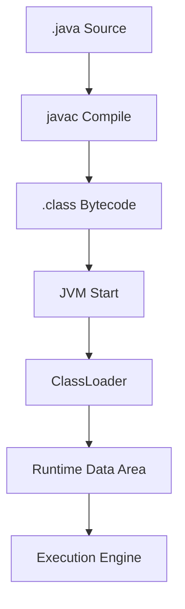
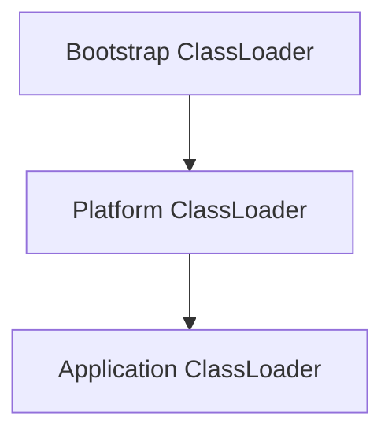
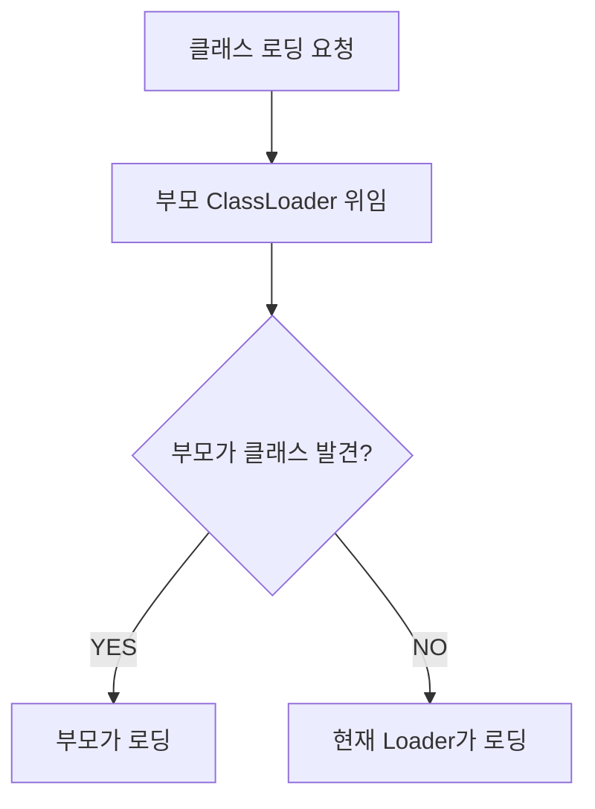
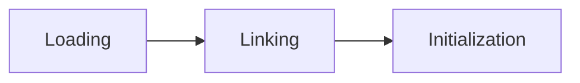
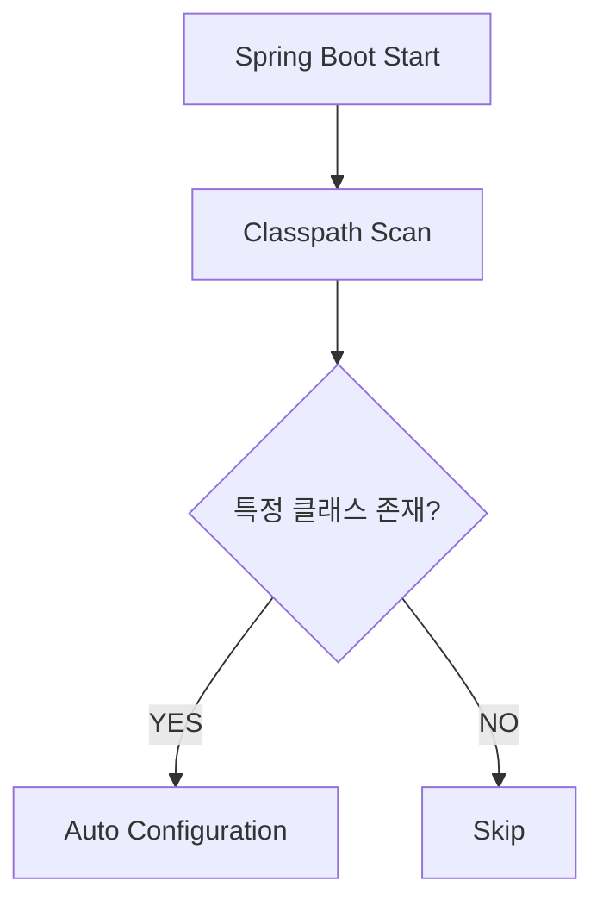
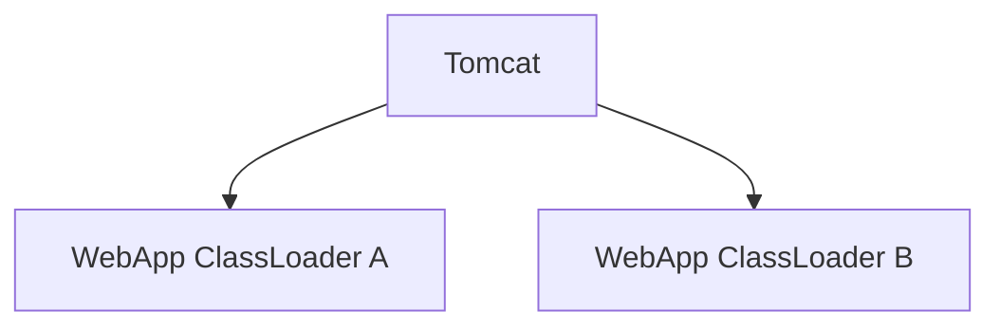

# 추천 파일명

2026-05-14-jvm-classloader-runtime-structure.md

---

## title: "JVM ClassLoader와 실행 구조 - 왜 Java는 동적으로 클래스를 로딩하는가?"  
date: 2026-05-14  
categories: [To-Be-Senior]  
tags: [Java, JVM, ClassLoader, Reflection, Runtime, Backend]

# JVM ClassLoader와 실행 구조

# 학습 목표

이번 주제의 핵심은 단순히:

> "ClassLoader는 클래스를 읽는 객체"

수준이 아니다.

실무에서는 다음을 이해해야 한다.

- JVM은 왜 ClassLoader 구조를 만들었는가?
    
- 왜 부모 위임 모델이 필요한가?
    
- Runtime Dynamic Loading은 어떤 장점을 가지는가?
    
- Reflection은 왜 느리다고 하는가?
    
- Spring은 어떻게 동적으로 Bean을 생성하는가?
    
- 운영 환경에서 ClassLoader는 왜 메모리 누수를 유발하는가?
    

즉:

> "Java 런타임 시스템의 핵심 메커니즘"

을 이해하는 것이 목표다.

---

# JVM 실행 구조



Java는:

> 실행 시점(Runtime)에 클래스 로딩이 이루어진다.

이게 C/C++와 가장 큰 차이 중 하나다.

---

# ClassLoader란 무엇인가?

ClassLoader는:

> `.class Bytecode를 JVM 메모리에 적재하는 역할`

을 수행한다.

Java의 모든 클래스는 반드시 ClassLoader를 통해 로딩된다.

---

# JVM ClassLoader 구조



## Bootstrap ClassLoader

최상위 로더.

핵심 Java 클래스 로딩 담당:

- java.lang
    
- java.util
    
- java.io
    

예:

```java
System.out.println(String.class.getClassLoader());
```

결과:

```text
null
```

Bootstrap Loader는 Native(C++) 영역에서 동작하기 때문에 `null`로 표현된다.

---

## Application ClassLoader

개발자가 작성한 클래스를 로딩한다.

```java
public class Main {

    public static void main(String[] args) {
        System.out.println(Main.class.getClassLoader());
    }
}
```

출력:

```text
jdk.internal.loader.ClassLoaders$AppClassLoader
```

---

# 부모 위임 모델 (Parent Delegation Model)

ClassLoader의 핵심 구조다.



---

# 왜 이렇게 설계했는가?

## 1. 보안

만약 부모 위임이 없다면:

```java
package java.lang;

public class String {
}
```

같은 악성 클래스를 만들 수 있다.

즉:

> Java 핵심 클래스를 위조 가능

해진다.

부모 위임 모델은 항상 Bootstrap Loader를 우선 사용하여 이를 막는다.

---

## 2. 클래스 중복 방지

Java에서 클래스는:

```text
클래스 이름 + ClassLoader
```

조합으로 식별된다.

즉:

같은 클래스라도 ClassLoader가 다르면 다른 타입이다.

---

# Loading → Linking → Initialization

클래스 로딩은 단순 파일 읽기가 아니다.

3단계를 거친다.



---

## 1. Loading

`.class` 파일을 읽는다.

---

## 2. Linking

메모리 연결 및 검증 수행.

세부 단계:

- Verify
    
- Prepare
    
- Resolve
    

여기서 Bytecode 검증이 발생한다.

---

## 3. Initialization

정적 변수 초기화 수행.

```java
static {
    System.out.println("init");
}
```

---

# Runtime Dynamic Loading

Java의 핵심 특징 중 하나다.

```java
Class<?> clazz =
    Class.forName("com.mysql.jdbc.Driver");
```

실행 시점에 클래스를 동적으로 로딩한다.

---

# 왜 중요한가?

이 구조 덕분에 Java는:

- Spring
    
- JDBC
    
- Tomcat
    
- JPA Proxy
    
- AOP Proxy
    

같은 강력한 런타임 확장성을 가진다.

즉:

> Java 생태계 유연성의 핵심

이다.

---

# Reflection과 연결

Reflection은:

> 런타임에 클래스 정보를 조작하는 기술

이다.

```java
Class<?> clazz = User.class;

Method[] methods =
    clazz.getDeclaredMethods();
```

---

# Spring은 왜 Reflection을 사용하는가?

Spring 내부는 Reflection 기반이다.

대표 사례:

- Bean 생성
    
- DI 주입
    
- AOP Proxy
    
- Annotation 분석
    

즉:

> Spring 내부는 Runtime Dynamic Loading + Reflection 기반

이라고 볼 수 있다.

---

# Reflection은 왜 느린가?

일반 호출:

```java
user.getName();
```

Reflection 호출:

```java
method.invoke(user);
```

Reflection은:

- 메타데이터 탐색
    
- 접근 제어 검사
    
- 동적 호출
    

과정이 추가된다.

---

# 하지만 실무에서 진짜 병목인가?

대부분은 아니다.

실제 병목은 보통:

- DB
    
- Network
    
- External API
    

에서 발생한다.

Reflection은 보통 startup 구간에서 많이 사용된다.

---

# Spring Boot Auto Configuration



대표 사례:

- JDBC Driver
    
- Redis
    
- Kafka
    

자동 연결.

---

# Tomcat과 ClassLoader

Tomcat은 애플리케이션별 독립 ClassLoader를 사용한다.



왜?

- 클래스 충돌 방지
    
- 독립 배포
    
- Hot Reload 지원
    

---

# 운영 환경 핵심 문제

# ClassLoader Memory Leak

실제 운영에서 매우 유명한 장애 원인이다.

특히:

- Tomcat
    
- DevTools
    
- Hot Reload
    

환경에서 자주 발생한다.

---

# 왜 발생하는가?

ClassLoader가 GC되지 못하면:

> 해당 Loader가 로딩한 모든 클래스도 GC 불가

상태가 된다.

대표 원인:

- static 객체
    
- ThreadLocal
    
- JDBC Driver 등록 누락
    
- Cache 객체
    

---

# 실제 장애 사례

재배포 반복 후:

```text
java.lang.OutOfMemoryError: Metaspace
```

발생.

원인:

- 이전 WebApp ClassLoader 미해제
    
- static cache 참조 유지
    

즉:

> 클래스 자체가 메모리 누수

되는 상황이다.

---

# 성능 관점

ClassLoader 자체는 빈번하지 않다.

하지만:

- reflection 남용
    
- proxy 과다 생성
    
- excessive dynamic loading
    

은 startup latency를 증가시킨다.

Spring Boot 초기 기동이 느린 이유 중 하나다.

---

# Trade-off

## 장점

- 유연성
    
- 런타임 확장
    
- 플러그인 구조
    
- 동적 시스템
    

## 단점

- startup 비용 증가
    
- 런타임 오류 증가
    
- 디버깅 난이도 상승
    
- classloader leak 위험
    

---

# 자주 발생하는 실수

## 1. Reflection 남용

불필요한 reflection 반복 호출.

---

## 2. static 객체 누수

재배포 환경에서 치명적.

---

## 3. custom ClassLoader 남발

매우 복잡한 디버깅 유발.

---

# 면접 꼬리 질문

## Q1. 부모 위임 모델은 왜 필요한가?

핵심:

- 보안
    
- 중복 로딩 방지
    
- Java Core 보호
    

---

## Q2. 같은 클래스인데 왜 ClassCastException이 가능한가?

핵심:

```text
클래스 + ClassLoader
```

조합이 타입 식별 기준이다.

---

## Q3. Spring은 왜 Reflection을 사용하는가?

핵심:

- 런타임 DI
    
- Annotation 기반 처리
    
- 유연성 확보
    

---

## Q4. Reflection은 왜 느린가?

핵심:

- 메타데이터 접근
    
- 동적 호출
    
- 최적화 제한
    

---

# 좋은 답변 예시

> JVM은 Runtime 시점에 ClassLoader를 통해 클래스를 로딩합니다.  
> Java는 부모 위임 모델을 통해 핵심 클래스를 보호하며 중복 로딩을 방지합니다.  
> 또한 Runtime Dynamic Loading 구조 덕분에 Spring, JDBC, WAS 같은 유연한 프레임워크 구조가 가능해졌습니다.  
> 다만 Reflection과 Dynamic Loading은 startup 비용과 ClassLoader leak 같은 운영 이슈를 유발할 수 있어 주의가 필요합니다.

---

# 관련 CS 개념 연결

연결되는 핵심 개념:

- Dynamic Linking
    
- Runtime System
    
- Virtual Machine
    
- Memory Management
    
- Plugin Architecture
    
- Dependency Injection
    
- Proxy Pattern
    

---

# 현업에서 특히 중요한 포인트

## 1. Spring 내부 동작 이해

대부분 Reflection 기반.

---

## 2. 재배포 환경 Memory Leak

운영 장애로 직결된다.

---

## 3. startup latency

MSA 환경에서 중요해진다.

---

# 핵심 요약

- Java는 Runtime Dynamic Loading 기반
    
- ClassLoader는 JVM 핵심 메커니즘
    
- 부모 위임 모델은 보안과 안정성을 위한 구조
    
- Spring 내부는 Reflection 기반
    
- Dynamic Loading은 유연성을 제공하지만 운영 복잡성을 증가시킨다
    
- ClassLoader leak은 실제 운영 장애 원인이다
    
- 실무에서는 “왜 이런 구조인가?”를 설명 가능해야 한다