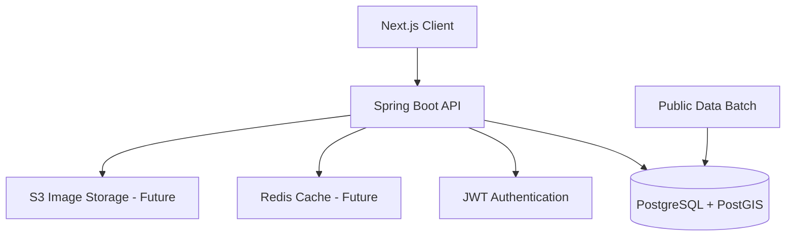
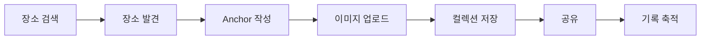

# DATT v2 아키텍처 설계 및 도메인 구조 분석

# 프로젝트 개요

DATT는:

> "공간에 기억을 남기는 위치 기반 기록 플랫폼"

을 목표로 하는 서비스다.

사용자는:

- 장소 검색
    
- 지도 탐색
    
- Anchor 기록
    
- 이미지 업로드
    
- 리뷰 작성
    
- 장소 저장 및 공유
    

등의 기능을 수행할 수 있다.

---

# 기존 구조의 문제점

기존 DATT는:

```text
실시간 크롤링 기반 장소 탐색 구조
```

에 가까웠다.

초기 구조:

```text
Client
    ↓
Spring Boot
    ↓
FastAPI Crawling Engine
    ↓
External Sources
    ↓
PostgreSQL
```

하지만 다음과 같은 문제가 존재했다.

---

# 기존 구조의 한계

## 1. 외부 서비스 의존성

- 실시간 크롤링 구조
    
- 외부 응답 지연
    
- 데이터 품질 불안정
    

---

## 2. 서비스 정체성 문제

기존 구조는:

```text
장소 검색 플랫폼
```

방향으로 확장될 위험이 존재했다.

하지만 DATT의 핵심은:

```text
장소 검색
```

이 아니라:

```text
장소 기반 기록 및 공유
```

이다.

---

## 3. 운영 리스크

- 크롤링 실패
    
- 응답 지연
    
- 외부 구조 변경
    
- 무한 데이터 범위
    

문제가 존재했다.

---

# DATT v2 핵심 방향

DATT v2에서는:

```text
외부 포털 데이터 의존 제거
```

를 핵심 방향으로 잡는다.

즉:

```text
공공데이터 = 장소 기본 정보

DATT 내부 데이터 = 장소 가치 데이터
```

구조로 변경한다.

---

# 핵심 설계 원칙

# 1. 장소 자체보다 기록이 중요하다

DATT는:

```text
맛집 플랫폼
```

이 아니라:

```text
기억 기록 플랫폼
```

이어야 한다.

따라서:

- Anchor
    
- 이미지
    
- 리뷰
    
- 컬렉션
    

등 사용자 활동이 핵심 도메인이 된다.

---

# 2. 장소는 공공데이터 기반으로 관리한다

장소 데이터는:

```text
공공데이터 기반 Place
```

를 사용한다.

즉:

- 장소명
    
- 좌표
    
- 주소
    
- 카테고리
    

등의 기본 정보는 공공데이터 기반으로 제공한다.

---

# 3. 장소의 가치는 내부 데이터로 성장한다

DATT 내부 데이터:

- Anchor 수
    
- 리뷰 수
    
- 이미지 수
    
- 저장 수
    
- 공유 수
    

를 기반으로 장소의 가치가 형성된다.

즉:

```text
DATT 내부 활동이 장소를 성장시킨다
```

구조다.

---

# 전체 아키텍처 구조



---

# 기술 스택

# Frontend

```text
Next.js 14
TypeScript
Tailwind
shadcn/ui
zustand
tanstack-query
```

---

# Backend

```text
Spring Boot 3.x
Java 17
Spring Security
JWT
JPA
Flyway
```

---

# Database

```text
PostgreSQL
PostGIS
Redis (추후)
```

---

# Infra

```text
Docker
Docker Compose
Nginx
```

---

# 핵심 도메인 구조

# 1. Member Domain

사용자 관련 도메인.

포함 기능:

- 회원가입
    
- 로그인
    
- JWT 인증
    
- 프로필
    
- 레벨/칭호
    

---

# 2. Place Domain

공공데이터 기반 장소 도메인.

포함 기능:

- 장소 검색
    
- 카테고리 조회
    
- 지도 조회
    
- place_group 관리
    

---

# 3. Anchor Domain

DATT 핵심 도메인.

포함 기능:

- Anchor 작성
    
- 이미지 업로드
    
- 공개 범위 설정
    

---

# 4. Review Domain

내부 리뷰 및 평점 관리.

포함 기능:

- 리뷰 작성
    
- 평점 작성
    
- 장소별 리뷰 조회
    

---

# 5. Collection Domain

장소 저장 및 공유.

포함 기능:

- 장소 컬렉션 생성
    
- 장소 저장
    
- 공유 링크 생성
    

---

# 6. Gamification Domain

기록 기반 성장 시스템.

포함 기능:

- 경험치
    
- 레벨
    
- 칭호
    
- 배지
    

---

# place vs place_group

DATT v2에서는:

```text
place
```

와

```text
place_group
```

를 분리한다.

---

# place

공공데이터 원본 장소.

예:

```text
스타벅스 성수점
스타벅스 성수역점
스타벅스 성수 DT점
```

---

# place_group

사용자에게 보여줄 대표 장소 단위.

즉:

```text
사용자 경험 중심 장소 단위
```

다.

---

# 장소 가치 계산 구조

외부 평점/리뷰는 사용하지 않는다.

모든 점수는:

```text
DATT 내부 활동 데이터
```

기반이다.

---

# 인기 점수 예시

```text
popular_score =
    anchor_count * 0.30
    + review_count * 0.25
    + image_count * 0.20
    + save_count * 0.15
    + share_count * 0.10
```

현재는 설계 가설이며,  
실제 데이터 기반 조정 예정이다.

---

# 게임화 방향

DATT의 게임화는:

```text
경쟁 중심
```

이 아니라:

```text
기록 축적 중심
```

이다.

예시:

- 성수 기록가
    
- 심야 탐험가
    
- Anchor Keeper
    

---

# UI/UX 방향

DATT는:

```text
지도 서비스
```

가 아니라:

```text
지도 기반 기록 플랫폼
```

방향으로 설계한다.

---

# 핵심 UX 흐름



---

# 운영 관점 고려 사항

# 1. 공공데이터 업데이트 정책

정기 배치 기반으로:

- 신규 장소
    
- 수정 장소
    
- 삭제 장소
    

를 관리한다.

---

# 2. 로그 관리

필수 로그:

- traceId
    
- request duration
    
- memberId
    
- error logging
    

---

# 3. 성능 고려

추후 적용 예정:

- Redis 캐싱
    
- 지도 bounds 조회 최적화
    
- PostGIS Index
    
- 인기 점수 배치 계산
    

---

# Trade-off

# 장점

|장점|
|---|
|외부 서비스 의존 제거|
|내부 데이터 기반 성장 구조|
|서비스 정체성 강화|
|운영 안정성 향상|
|장소 기록 중심 UX 가능|

---

# 단점

|단점|
|---|
|초기 데이터 부족|
|초기 리뷰/이미지 부족|
|사용자 활동 의존성 증가|
|인기 장소 형성까지 시간 필요|

---

# 왜 이런 구조를 선택했는가?

기존에는:

```text
외부 장소 데이터 중심 구조
```

였다.

하지만 이는:

- 외부 의존성
    
- 운영 리스크
    
- 데이터 무한 확장
    

문제를 발생시켰다.

따라서 DATT v2에서는:

```text
장소 데이터 플랫폼
```

이 아니라:

```text
공간 기반 기록 플랫폼
```

방향으로 재정의했다.

---

# 앞으로의 방향

DATT v2의 핵심은:

```text
사용자의 기록이 장소를 완성한다
```

는 구조다.

즉:

- Anchor
    
- 이미지
    
- 리뷰
    
- 컬렉션
    

이 쌓이면서 장소의 가치가 성장한다.

---

# 마무리

DATT v2는 단순 장소 검색 서비스가 아니다.

핵심은:

```text
공간에 기억을 남기고
그 기록이 축적되는 경험
```

이다.

앞으로는:

- 운영 안정성
    
- 내부 데이터 기반 성장
    
- 기록 중심 UX
    
- 사용자 아카이브 경험
    

을 중심으로 서비스를 고도화할 예정이다.

---  

# [문서] 공통 응답, 예외 처리, Request Logging 기반 구축  
  
DATT v2 프로젝트를 새롭게 시작하면서 가장 먼저 고민한 것은 기능 구현이 아니었다.  
  
오히려 먼저 고민한 것은:  
  
- 응답 구조를 어떻게 통일할 것인가?  
- 예외를 어떻게 처리할 것인가?  
- 운영 시 로그를 어떻게 추적할 것인가?  
  
였다.  
  
많은 개인 프로젝트들이 기능 구현 자체에만 집중한다.  
  
하지만 실제 운영 환경에서는 기능보다 더 중요한 것이 존재한다.  
  
예를 들면:  
  
- 어떤 요청이 실패했는가?  
- 왜 실패했는가?  
- 어떤 API에서 병목이 발생했는가?  
- 어떤 요청 흐름에서 장애가 발생했는가?  
  
같은 문제들이다.  
  
DATT는 단순 CRUD 프로젝트가 아니라:  
  
"실무형 Java 백엔드 포트폴리오"  
  
를 목표로 하고 있기 때문에, 가장 먼저 공통 응답 구조와 운영 기반을 구축하기로 했다.  
  
이번 글에서는 다음 내용을 정리한다.  
  
- ApiResponse 기반 공통 응답 구조  
- GlobalExceptionHandler 기반 예외 처리  
- ErrorCode 설계 전략  
- Request Logging 구조  
- MDC 기반 traceId 적용 이유  
  
---  
  
# 본문  
  
# 왜 공통 응답 구조가 필요한가  
  
초기 프로젝트에서는 보통 아래처럼 Controller마다 응답 형식이 달라지는 경우가 많다.  
  
예:  
  
성공 응답:  
  
{  
"id": 1,  
"name": "datt"  
}  
  
실패 응답:  
  
{  
"message": "잘못된 요청입니다."  
}  
  
또 다른 API:  
  
{  
"success": true,  
"result": {}  
}  
  
이런 구조는 시간이 지나면 점점 유지보수가 어려워진다.  
  
특히 프론트엔드 입장에서는:  
  
- 어떤 필드가 항상 존재하는가?  
- 에러 응답은 어떤 구조인가?  
- Validation 에러는 어떻게 처리하는가?  
  
를 API마다 다르게 처리해야 한다.  
  
그래서 DATT에서는 모든 응답 구조를 통일하기로 했다.  
  
---  
  
# ApiResponse 설계  
  
최종적으로 선택한 구조는 다음과 같다.  
  
정상 응답:  
  
{  
"success": true,  
"data": {},  
"error": null  
}  
  
실패 응답:  
  
{  
"success": false,  
"data": null,  
"error": {  
"code": "member.not_found",  
"message": "사용자를 찾을 수 없습니다.",  
"status": 404  
}  
}  
  
이를 위한 공통 응답 객체는 다음과 같이 설계했다.  
  
public record ApiResponse<T>(  
boolean success,  
T data,  
ErrorResponse error  
) {  
  
public static <T> ApiResponse<T> success(T data) {  
return new ApiResponse<>(true, data, null);  
}  
  
public static ApiResponse<Void> success() {  
return new ApiResponse<>(true, null, null);  
}  
  
public static ApiResponse<Void> fail(ErrorResponse error) {  
return new ApiResponse<>(false, null, error);  
}  
}  
  
---  
  
# 왜 Generic 기반으로 설계했는가  
  
ApiResponse를 Generic으로 설계한 이유는 API마다 응답 타입이 달라지기 때문이다.  
  
예를 들어:  
  
회원 조회 API:  
  
ApiResponse<MemberResponse>  
  
장소 조회 API:  
  
ApiResponse<PlaceResponse>  
  
리스트 조회 API:  
  
ApiResponse<List<PlaceResponse>>  
  
처럼 사용할 수 있다.  
  
이 방식의 장점은 다음과 같다.  
  
- 타입 안정성 확보  
- IDE 자동완성 지원  
- Swagger/OpenAPI 타입 추론 가능  
- 유지보수성 향상  
  
---  
  
# 왜 ErrorCode를 분리했는가  
  
처음에는 단순히 message만 내려주는 구조도 고민했다.  
  
예:  
  
{  
"message": "사용자를 찾을 수 없습니다."  
}  
  
하지만 운영 환경에서는 message만으로는 부족하다.  
  
왜냐하면:  
  
- 프론트 분기 처리  
- 로그 검색  
- 장애 추적  
- 에러 유형 분류  
  
등이 어렵기 때문이다.  
  
그래서 ErrorCode를 별도로 분리했다.  
  
---  
  
# ErrorCode 설계 전략  
  
초기에는 다음과 같은 숫자 기반 코드도 고려했다.  
  
MEMBER_001  
COMMON_400  
  
하지만 이 방식은 점점 의미 파악이 어려워진다.  
  
그래서 최종적으로는 semantic naming 방식을 선택했다.  
  
예:  
  
member.not_found  
member.duplicated_email  
auth.invalid_token  
common.internal_server_error  
  
이 방식의 장점은 다음과 같다.  
  
- 의미 파악이 직관적  
- 로그 검색이 쉬움  
- 번호 충돌 없음  
- 유지보수성 향상  
  
실제 운영 환경에서도 semantic naming 기반 에러 코드가 점점 많아지는 추세다.  
  
---  
  
# GlobalExceptionHandler 도입 이유  
  
초기 프로젝트에서는 보통 Controller마다 try-catch를 남발하게 된다.  
  
예:  
  
try {  
...  
} catch (...) {  
...  
}  
  
하지만 이 방식은:  
  
- 중복 코드 증가  
- 응답 구조 불일치  
- 유지보수 난이도 증가  
  
문제가 발생한다.  
  
그래서 DATT에서는 GlobalExceptionHandler 기반으로 예외를 중앙 집중 처리하도록 설계했다.  
  
핵심 구조는 다음과 같다.  
  
Controller  
↓  
Service  
↓  
Exception 발생  
↓  
GlobalExceptionHandler  
↓  
ApiResponse.fail()  
  
즉:  
  
비즈니스 로직은 예외만 발생시키고,  
응답 생성은 GlobalExceptionHandler가 담당한다.  
  
---  
  
# Validation 응답을 별도로 분리한 이유  
  
Validation 오류는 일반 예외와 성격이 다르다.  
  
예:  
  
{  
"field": "email",  
"message": "이메일 형식이 올바르지 않습니다."  
}  
  
처럼 필드 단위 정보가 필요하다.  
  
그래서 ValidationErrorResponse를 별도로 분리했다.  
  
예상 응답:  
  
{  
"success": false,  
"data": null,  
"error": {  
"code": "common.invalid_input_value",  
"message": "요청 값이 올바르지 않습니다.",  
"status": 400,  
"errors": [  
{  
"field": "email",  
"message": "이메일 형식이 올바르지 않습니다."  
}  
]  
}  
}  
  
---  
  
# 왜 Request Logging을 먼저 구축했는가  
  
기능 개발보다 먼저 Request Logging을 구축한 이유는 운영 관점 때문이다.  
  
실제 운영 환경에서는:  
  
- 어떤 요청이 느린가?  
- 어떤 API에서 장애가 발생했는가?  
- 어떤 요청 흐름에서 예외가 발생했는가?  
  
를 추적할 수 있어야 한다.  
  
그래서 DATT에서는 OncePerRequestFilter 기반으로 Request Logging을 먼저 구축했다.  
  
예상 로그:  
  
event=request_completed traceId=abc123 method=GET uri=/api/health status=200 durationMs=12  
  
---  
  
# traceId를 적용한 이유  
  
처음에는 단순 request log만 남길 생각이었다.  
  
하지만 요청 흐름을 추적하려면:  
  
"같은 요청"  
  
이라는 것을 식별할 수 있어야 한다.  
  
그래서 MDC 기반 traceId를 적용했다.  
  
핵심 흐름:  
  
요청 시작  
↓  
traceId 생성  
↓  
MDC 저장  
↓  
로그 출력  
↓  
요청 종료  
↓  
MDC clear  
  
이 구조를 통해:  
  
- 요청 단위 로그 추적  
- 장애 분석  
- 요청 흐름 연결  
  
이 가능해진다.  
  
---  
  
# 왜 아직 Structured Logging까지는 하지 않았는가  
  
실무에서는 JSON 기반 Structured Logging도 많이 사용한다.  
  
예:  
  
{  
"event": "request_completed",  
"traceId": "abc123",  
"durationMs": 12  
}  
  
하지만 현재 DATT 단계에서는 아직:  
  
- Grafana  
- Loki  
- ELK  
- OpenTelemetry  
  
같은 관측 시스템이 없다.  
  
그래서 현재는:  
  
"단순 문자열 기반 운영 로그"  
  
수준까지만 우선 적용했다.  
  
추후:  
  
- Prometheus  
- Grafana  
- Loki  
- 분산 추적  
  
등을 추가할 예정이다.  
  
---  
  
# 운영 관점에서 중요했던 부분  
  
이번 작업에서 가장 중요하게 생각한 것은:  
  
"왜 이렇게 설계하는가?"  
  
였다.  
  
단순히:  
  
- 예외 처리 구현  
- 응답 구조 구현  
  
이 아니라:  
  
- 운영 시 어떤 문제가 발생하는가?  
- 장애 분석은 가능한가?  
- 요청 흐름 추적은 가능한가?  
- 응답 구조는 일관적인가?  
  
를 계속 고민하면서 설계했다.  
  
---  
  
# 마무리  
  
이번 작업을 통해 DATT v2는 단순 CRUD 프로젝트가 아니라:  
  
- 공통 응답 구조  
- 운영 로그 기반  
- 예외 처리 전략  
- 요청 추적 구조  
  
를 갖춘 형태로 발전하기 시작했다.  
  
아직은 초기 단계지만:  
  
기능 구현보다  
운영 가능한 구조를 먼저 만든다  
  
는 방향으로 프로젝트를 진행하고 있다.  
  
앞으로는:  
  
- JWT 인증  
- Place 검색  
- Review  
- Redis Cache  
- 성능 측정  
- 병목 분석  
  
등을 추가적으로 구축할 예정이다.  
  
---  
  
# 핵심 요약  
  
이번 작업의 핵심은 다음과 같다.  
  
- ApiResponse 기반 응답 구조 통일  
- ErrorCode 기반 에러 관리  
- GlobalExceptionHandler 기반 예외 처리 중앙화  
- Request Logging 기반 운영 로그 구축  
- MDC traceId 기반 요청 추적 구조 적용  
  
그리고 가장 중요한 것은:  
  
"실무 운영 관점"  
  
에서 구조를 고민하기 시작했다는 점이다.