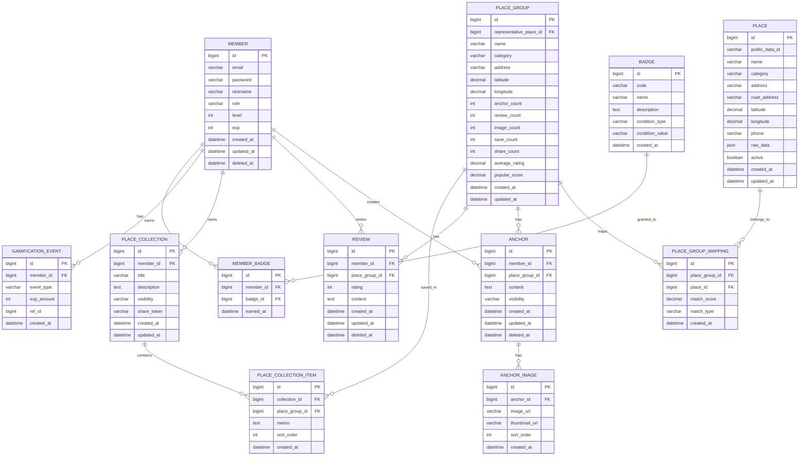

# DATT v2 ERD 설계 및 도메인 관계 분석

# 설계 목표

DATT v2의 핵심 방향은 다음과 같다.

    공공데이터 = 장소 기본 정보
    DATT 내부 데이터 = 장소 가치 데이터

따라서 ERD 설계의 핵심은 단순한 장소 저장이 아니라 다음 기능들을 하나의 구조로 연결하는 것이다.

- 공공데이터 기반 장소 관리
- 장소 그룹화
- 사용자 Anchor 기록
- 이미지 업로드
- 리뷰/평점
- 장소 컬렉션
- 공유
- 게임화

---

# 핵심 도메인

| 도메인 | 역할 |
|---|---|
| Member | 사용자 |
| Place | 공공데이터 기반 장소 |
| PlaceGroup | 사용자에게 노출되는 대표 장소 |
| Anchor | 장소에 남기는 기록 |
| Review | 내부 리뷰 및 평점 |
| Collection | 장소 저장 및 공유 |
| Gamification | 경험치, 레벨, 칭호 |
| File | 이미지 |

---

# 전체 ERD

---

# 테이블 설계

# 1. member

사용자 계정 정보를 관리한다.

| 컬럼 | 설명 |
|---|---|
| id | 사용자 PK |
| email | 로그인 이메일 |
| password | 암호화된 비밀번호 |
| nickname | 닉네임 |
| role | 사용자 권한 |
| level | 사용자 레벨 |
| exp | 누적 경험치 |
| created_at | 생성일 |
| updated_at | 수정일 |
| deleted_at | 탈퇴 또는 삭제 처리일 |

회원 도메인은 추후 OAuth2 확장을 고려할 수 있지만, v2 초기 단계에서는 자체 회원가입과 JWT 기반 인증을 우선한다.

---

# 2. place

공공데이터 원본 장소를 저장한다.

| 컬럼 | 설명 |
|---|---|
| id | 장소 PK |
| public_data_id | 공공데이터 원본 식별자 |
| name | 장소명 |
| category | 카테고리 |
| address | 지번 주소 |
| road_address | 도로명 주소 |
| latitude | 위도 |
| longitude | 경도 |
| phone | 전화번호 |
| raw_data | 공공데이터 원본 JSON |
| active | 활성 여부 |
| created_at | 생성일 |
| updated_at | 수정일 |

place는 사용자에게 직접 노출되는 최종 장소 단위가 아니다.

place는 어디까지나 공공데이터 원천 데이터를 저장하는 테이블이다.

---

# 3. place_group

사용자에게 노출되는 대표 장소 단위다.

| 컬럼 | 설명 |
|---|---|
| id | 장소 그룹 PK |
| representative_place_id | 대표 place ID |
| name | 대표 장소명 |
| category | 대표 카테고리 |
| address | 대표 주소 |
| latitude | 대표 위도 |
| longitude | 대표 경도 |
| anchor_count | Anchor 수 |
| review_count | 리뷰 수 |
| image_count | 이미지 수 |
| save_count | 저장 수 |
| share_count | 공유 수 |
| average_rating | 내부 평균 평점 |
| popular_score | 내부 인기 점수 |
| created_at | 생성일 |
| updated_at | 수정일 |

DATT에서 사용자가 검색하고, 지도에서 보고, Anchor를 남기는 기준은 place가 아니라 place_group이다.

---

# 4. place_group_mapping

place와 place_group의 연결 관계를 관리한다.

| 컬럼 | 설명 |
|---|---|
| id | 매핑 PK |
| place_group_id | 장소 그룹 ID |
| place_id | 원본 장소 ID |
| match_score | 매칭 점수 |
| match_type | 매칭 방식 |
| created_at | 생성일 |

match_type 예시는 다음과 같다.

| 값 | 의미 |
|---|---|
| AUTO | 자동 매칭 |
| MANUAL | 관리자 수동 매칭 |
| CANDIDATE | 후보 매칭 |

공공데이터는 중복, 표기 차이, 주소 차이 문제가 있을 수 있으므로 원본 장소와 대표 장소를 분리한다.

---

# 5. anchor

사용자가 장소에 남기는 핵심 기록이다.

| 컬럼 | 설명 |
|---|---|
| id | Anchor PK |
| member_id | 작성자 ID |
| place_group_id | 장소 그룹 ID |
| content | 기록 내용 |
| visibility | 공개 범위 |
| created_at | 생성일 |
| updated_at | 수정일 |
| deleted_at | 삭제일 |

visibility 예시는 다음과 같다.

| 값 | 의미 |
|---|---|
| PUBLIC | 전체 공개 |
| PRIVATE | 비공개 |
| FRIENDS | 친구 공개, 추후 확장 |

DATT의 핵심 도메인은 장소 자체가 아니라 Anchor다.

---

# 6. anchor_image

Anchor에 첨부된 이미지를 관리한다.

| 컬럼 | 설명 |
|---|---|
| id | 이미지 PK |
| anchor_id | Anchor ID |
| image_url | 원본 이미지 URL |
| thumbnail_url | 썸네일 URL |
| sort_order | 이미지 정렬 순서 |
| created_at | 생성일 |

이미지는 장소 카드의 대표 이미지를 구성하는 중요한 데이터가 된다.

이미지 우선순위는 다음과 같이 설계한다.

1. 사용자가 직접 업로드한 Anchor 이미지
2. 공공데이터 이미지가 있는 경우 해당 이미지
3. 카테고리 기본 이미지

---

# 7. review

DATT 내부 리뷰와 평점을 저장한다.

| 컬럼 | 설명 |
|---|---|
| id | 리뷰 PK |
| member_id | 작성자 ID |
| place_group_id | 장소 그룹 ID |
| rating | 내부 평점 |
| content | 리뷰 내용 |
| created_at | 생성일 |
| updated_at | 수정일 |
| deleted_at | 삭제일 |

외부 평점이나 외부 리뷰는 사용하지 않는다.

장소의 평판은 DATT 내부 사용자 활동으로만 형성한다.

---

# 8. place_collection

사용자가 장소를 묶어 저장하고 공유하는 컬렉션이다.

| 컬럼 | 설명 |
|---|---|
| id | 컬렉션 PK |
| member_id | 소유자 ID |
| title | 컬렉션 제목 |
| description | 컬렉션 설명 |
| visibility | 공개 범위 |
| share_token | 공유 토큰 |
| created_at | 생성일 |
| updated_at | 수정일 |

예시는 다음과 같다.

- 성수 작업 카페 모음
- 서울 심야 산책 장소
- 부산 여행 숙소 후보

---

# 9. place_collection_item

컬렉션에 포함된 장소를 관리한다.

| 컬럼 | 설명 |
|---|---|
| id | 컬렉션 아이템 PK |
| collection_id | 컬렉션 ID |
| place_group_id | 장소 그룹 ID |
| memo | 사용자 메모 |
| sort_order | 정렬 순서 |
| created_at | 생성일 |

컬렉션은 단순 북마크가 아니라 지도 기반 장소 아카이브 기능이다.

---

# 10. gamification_event

사용자 활동에 따른 경험치 이벤트를 저장한다.

| 컬럼 | 설명 |
|---|---|
| id | 이벤트 PK |
| member_id | 사용자 ID |
| event_type | 이벤트 유형 |
| exp_amount | 지급 경험치 |
| ref_id | 관련 도메인 ID |
| created_at | 생성일 |

event_type 예시는 다음과 같다.

| 값 | 경험치 |
|---|---:|
| ANCHOR_CREATED | 10 |
| IMAGE_UPLOADED | 15 |
| REVIEW_CREATED | 10 |
| COLLECTION_CREATED | 5 |
| COLLECTION_SHARED | 5 |

경험치 지급 이력은 반드시 별도 테이블로 남긴다.

이유는 다음과 같다.

- 중복 지급 방지
- 사용자 활동 추적
- 운영 감사
- 레벨 정책 변경 대응

---

# 11. badge

칭호와 배지의 기준 정보를 관리한다.

| 컬럼 | 설명 |
|---|---|
| id | 배지 PK |
| code | 배지 코드 |
| name | 배지명 |
| description | 설명 |
| condition_type | 조건 유형 |
| condition_value | 조건 값 |
| created_at | 생성일 |

예시는 다음과 같다.

| code | name | 조건 |
|---|---|---|
| ANCHOR_KEEPER | Anchor Keeper | Anchor 10개 작성 |
| NIGHT_EXPLORER | 심야 탐험가 | 야간 Anchor 5개 작성 |
| SEONGSU_RECORDER | 성수 기록가 | 성수 지역 Anchor 5개 작성 |

---

# 12. member_badge

사용자가 획득한 배지를 저장한다.

| 컬럼 | 설명 |
|---|---|
| id | 사용자 배지 PK |
| member_id | 사용자 ID |
| badge_id | 배지 ID |
| earned_at | 획득일 |

---

# 핵심 설계 포인트

# 1. place와 place_group을 분리한 이유

공공데이터는 다음 문제가 있을 수 있다.

- 동일 장소 중복
- 이름 표기 차이
- 주소 표기 차이
- 좌표 오차
- 카테고리 불일치
- 데이터 갱신 주기 차이

따라서 원본 데이터와 사용자 노출 단위를 분리한다.

    place = 공공데이터 원본
    place_group = 사용자에게 보여줄 대표 장소

이렇게 분리하면 공공데이터가 변경되어도 사용자 기록인 Anchor, Review, Collection은 안정적으로 유지할 수 있다.

---

# 2. DATT 내부 데이터 기반 인기 점수

외부 리뷰와 외부 평점은 사용하지 않는다.

따라서 장소의 인기 점수는 DATT 내부 활동 기준으로 계산한다.

    popular_score =
        anchor_count * 0.30
        + review_count * 0.25
        + image_count * 0.20
        + save_count * 0.15
        + share_count * 0.10

이 수식은 현재 설계 가설이다.

실제 운영 데이터가 쌓이면 가중치를 조정해야 한다.

---

# 3. 리뷰가 없는 장소 처리

리뷰가 없는 장소를 숨기면 초기 서비스에서 노출 가능한 장소가 지나치게 줄어든다.

따라서 리뷰가 없는 장소는 다음과 같이 처리한다.

| 상태 | 처리 |
|---|---|
| 리뷰 없음 | 평균 평점 null |
| Anchor 있음 | Anchor 기반 노출 가능 |
| 이미지 있음 | 이미지 기반 카드 강화 |
| 내부 활동 없음 | 공공데이터 기본 장소로 노출 |

화면에서는 다음과 같이 표현할 수 있다.

    아직 리뷰가 부족한 장소입니다.
    첫 번째 Anchor를 남겨보세요.

---

# 4. Soft Delete 전략

member, anchor, review는 deleted_at 기반 Soft Delete를 사용한다.

이유는 다음과 같다.

- 사용자 복구 가능성
- 운영 감사
- 통계 보존
- 게임화 이벤트 이력 유지

단, 개인정보 삭제 요청이 있는 경우 별도 익명화 정책이 필요하다.

---

# 5. 인기 점수 집계 전략

popular_score는 요청마다 실시간 계산하지 않는다.

추천 방향은 배치 계산이다.

    사용자 활동 발생
        ↓
    count 컬럼 증가
        ↓
    배치 또는 이벤트 기반 popular_score 갱신

이유는 다음과 같다.

- 조회 성능 확보
- 지도 API 응답 속도 개선
- 복잡한 집계 쿼리 방지

---

# 6. 지도 조회 성능 고려

지도 기반 서비스에서는 bounds 조회가 중요하다.

예상 조회 조건은 다음과 같다.

    현재 지도 영역 안의 장소 조회
    카테고리 필터
    인기순 정렬
    최근 Anchor 존재 여부
    내가 저장한 장소 여부

PostGIS 사용 시 위치 컬럼에 공간 인덱스를 적용할 예정이다.

---

# 예상 인덱스 전략

| 테이블 | 인덱스 |
|---|---|
| member | email unique |
| place | public_data_id unique |
| place | latitude, longitude 또는 geometry |
| place_group | latitude, longitude 또는 geometry |
| place_group | category |
| place_group | popular_score |
| anchor | member_id |
| anchor | place_group_id |
| review | member_id, place_group_id |
| place_collection | member_id |
| place_collection_item | collection_id |
| gamification_event | member_id, event_type |

---

# Trade-off

# 장점

| 장점 |
|---|
| 공공데이터와 사용자 데이터를 분리할 수 있다 |
| 공공데이터 변경에 사용자 기록이 덜 흔들린다 |
| 내부 데이터 기반 장소 성장 구조를 만들 수 있다 |
| 지도, 컬렉션, 게임화 확장이 쉽다 |
| 포털 데이터 의존성을 제거할 수 있다 |

---

# 단점

| 단점 |
|---|
| place_group 매칭 로직이 필요하다 |
| 초기에는 이미지와 리뷰가 부족할 수 있다 |
| popular_score 정책 설계가 필요하다 |
| 배치 처리와 집계 로직이 추가된다 |
| 사용자 활동이 쌓이기 전까지 서비스 밀도가 낮을 수 있다 |

---

# 면접에서 설명할 포인트

이 ERD에서 가장 중요한 설명 포인트는 다음과 같다.

1. 왜 place와 place_group을 분리했는가?
2. 왜 외부 리뷰/평점을 사용하지 않았는가?
3. 리뷰가 없는 장소는 어떻게 노출할 것인가?
4. popular_score를 실시간 계산하지 않는 이유는 무엇인가?
5. 사용자 활동 데이터가 어떻게 장소 가치를 만드는가?
6. 지도 조회 성능은 어떻게 고려했는가?
7. Soft Delete를 적용한 이유는 무엇인가?

---

# 마무리

DATT v2 ERD의 핵심은 다음 문장으로 요약할 수 있다.

    사용자의 기록이 장소를 완성한다.

장소의 기본 정보는 공공데이터에서 가져오지만, 장소의 가치는 DATT 내부 사용자 활동으로 만들어진다.

따라서 ERD는 장소 자체보다 다음 데이터를 중심으로 설계했다.

- Anchor
- Review
- Image
- Collection
- Gamification

이 구조를 기반으로 DATT v2는 단순 장소 검색 서비스가 아니라 위치 기반 기록 플랫폼으로 발전할 수 있다.