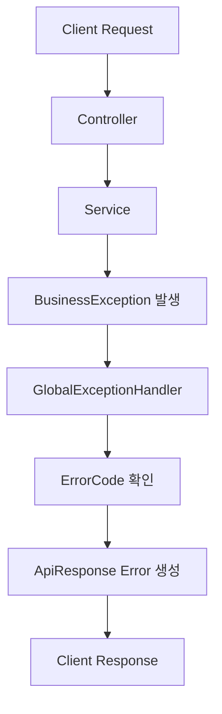

# DATT v2 공통 예외 처리 설계

# 설계 목표

DATT v2에서는 기능 개발보다 먼저 공통 예외 처리 구조를 설계한다.

이유는 간단하다.

    예외 처리가 흩어지면 API 응답 형식이 깨지고,
    프론트엔드와 백엔드 모두 에러 상황을 일관되게 다루기 어려워진다.

따라서 모든 API 예외는 하나의 규칙으로 응답하도록 설계한다.

---

# 기존 문제

초기 프로젝트에서 흔히 발생하는 문제는 다음과 같다.

- Controller마다 다른 에러 응답
- RuntimeException 직접 사용
- HTTP Status와 비즈니스 에러 코드 불일치
- 프론트엔드에서 에러 메시지 처리 어려움
- 로그에 원인 추적 정보 부족
- Validation 에러 응답 구조 불명확

이런 구조에서는 장애 상황에서 다음 질문에 답하기 어렵다.

    어떤 요청에서 실패했는가?
    어떤 비즈니스 규칙이 깨졌는가?
    사용자에게 어떤 메시지를 보여줘야 하는가?
    서버 로그에서 어떻게 추적할 것인가?

---

# 공통 예외 처리의 핵심 방향

DATT v2의 예외 처리 방향은 다음과 같다.

| 항목 | 방향 |
|---|---|
| 응답 형식 | 모든 API 응답을 ApiResponse로 통일 |
| 비즈니스 예외 | BusinessException 사용 |
| 에러 코드 | ErrorCode enum으로 관리 |
| 전역 처리 | GlobalExceptionHandler에서 처리 |
| Validation | 필드 단위 에러 메시지 제공 |
| 로그 | traceId, path, status, errorCode 포함 |
| 사용자 메시지 | 클라이언트 표시 가능 메시지 분리 |

---

# 전체 예외 처리 흐름

---

# 공통 응답 구조

DATT v2의 API 응답은 성공과 실패 모두 같은 구조를 사용한다.

    {
        "success": true,
        "data": {},
        "error": null
    }

실패 응답은 다음과 같다.

    {
        "success": false,
        "data": null,
        "error": {
            "code": "MEMBER_NOT_FOUND",
            "message": "사용자를 찾을 수 없습니다.",
            "status": 404
        }
    }

---

# ApiResponse 설계

ApiResponse는 성공 응답과 실패 응답을 통일하기 위한 wrapper다.

    public record ApiResponse<T>(
            boolean success,
            T data,
            ErrorResponse error
    ) {

        public static <T> ApiResponse<T> success(T data) {
            return new ApiResponse<>(true, data, null);
        }

        public static ApiResponse<Void> success() {
            return new ApiResponse<>(true, null, null);
        }

        public static ApiResponse<Void> fail(ErrorResponse error) {
            return new ApiResponse<>(false, null, error);
        }
    }

---

# ErrorResponse 설계

ErrorResponse는 클라이언트가 에러를 처리하기 위한 최소 정보를 담는다.

    public record ErrorResponse(
            String code,
            String message,
            int status
    ) {

        public static ErrorResponse from(ErrorCode errorCode) {
            return new ErrorResponse(
                    errorCode.getCode(),
                    errorCode.getMessage(),
                    errorCode.getStatus().value()
            );
        }
    }

Validation 에러처럼 필드별 에러가 필요한 경우 확장 응답을 따로 둔다.

    public record ValidationErrorResponse(
            String code,
            String message,
            int status,
            List<FieldErrorResponse> errors
    ) {

        public static ValidationErrorResponse of(
                ErrorCode errorCode,
                List<FieldErrorResponse> errors
        ) {
            return new ValidationErrorResponse(
                    errorCode.getCode(),
                    errorCode.getMessage(),
                    errorCode.getStatus().value(),
                    errors
            );
        }
    }

    public record FieldErrorResponse(
            String field,
            String message
    ) {
    }

---

# ErrorCode 설계

ErrorCode는 HTTP Status, 내부 에러 코드, 사용자 메시지를 함께 관리한다.

    @Getter
    @RequiredArgsConstructor
    public enum ErrorCode {

        // Common
        INTERNAL_SERVER_ERROR(
                HttpStatus.INTERNAL_SERVER_ERROR,
                "COMMON_500",
                "서버 내부 오류가 발생했습니다."
        ),
        INVALID_INPUT_VALUE(
                HttpStatus.BAD_REQUEST,
                "COMMON_400",
                "요청 값이 올바르지 않습니다."
        ),
        METHOD_NOT_ALLOWED(
                HttpStatus.METHOD_NOT_ALLOWED,
                "COMMON_405",
                "지원하지 않는 HTTP 메서드입니다."
        ),

        // Auth
        INVALID_LOGIN_REQUEST(
                HttpStatus.UNAUTHORIZED,
                "AUTH_001",
                "이메일 또는 비밀번호가 올바르지 않습니다."
        ),
        INVALID_TOKEN(
                HttpStatus.UNAUTHORIZED,
                "AUTH_002",
                "유효하지 않은 토큰입니다."
        ),
        EXPIRED_TOKEN(
                HttpStatus.UNAUTHORIZED,
                "AUTH_003",
                "만료된 토큰입니다."
        ),
        ACCESS_DENIED(
                HttpStatus.FORBIDDEN,
                "AUTH_004",
                "접근 권한이 없습니다."
        ),

        // Member
        MEMBER_NOT_FOUND(
                HttpStatus.NOT_FOUND,
                "MEMBER_001",
                "사용자를 찾을 수 없습니다."
        ),
        DUPLICATED_EMAIL(
                HttpStatus.CONFLICT,
                "MEMBER_002",
                "이미 사용 중인 이메일입니다."
        ),
        DUPLICATED_NICKNAME(
                HttpStatus.CONFLICT,
                "MEMBER_003",
                "이미 사용 중인 닉네임입니다."
        ),

        // Place
        PLACE_NOT_FOUND(
                HttpStatus.NOT_FOUND,
                "PLACE_001",
                "장소를 찾을 수 없습니다."
        ),
        PLACE_GROUP_NOT_FOUND(
                HttpStatus.NOT_FOUND,
                "PLACE_002",
                "장소 그룹을 찾을 수 없습니다."
        ),

        // Anchor
        ANCHOR_NOT_FOUND(
                HttpStatus.NOT_FOUND,
                "ANCHOR_001",
                "Anchor를 찾을 수 없습니다."
        ),
        ANCHOR_ACCESS_DENIED(
                HttpStatus.FORBIDDEN,
                "ANCHOR_002",
                "Anchor에 접근할 권한이 없습니다."
        ),

        // Review
        REVIEW_NOT_FOUND(
                HttpStatus.NOT_FOUND,
                "REVIEW_001",
                "리뷰를 찾을 수 없습니다."
        ),
        DUPLICATED_REVIEW(
                HttpStatus.CONFLICT,
                "REVIEW_002",
                "이미 리뷰를 작성한 장소입니다."
        ),
        INVALID_REVIEW_RATING(
                HttpStatus.BAD_REQUEST,
                "REVIEW_003",
                "평점은 1점 이상 5점 이하만 가능합니다."
        ),

        // Collection
        COLLECTION_NOT_FOUND(
                HttpStatus.NOT_FOUND,
                "COLLECTION_001",
                "컬렉션을 찾을 수 없습니다."
        ),
        COLLECTION_ACCESS_DENIED(
                HttpStatus.FORBIDDEN,
                "COLLECTION_002",
                "컬렉션에 접근할 권한이 없습니다."
        ),

        // File
        FILE_UPLOAD_FAILED(
                HttpStatus.INTERNAL_SERVER_ERROR,
                "FILE_001",
                "파일 업로드에 실패했습니다."
        ),
        INVALID_FILE_EXTENSION(
                HttpStatus.BAD_REQUEST,
                "FILE_002",
                "지원하지 않는 파일 형식입니다."
        );

        private final HttpStatus status;
        private final String code;
        private final String message;
    }

---

# BusinessException 설계

비즈니스 규칙 위반은 RuntimeException을 직접 던지지 않고 BusinessException으로 감싼다.

    @Getter
    public class BusinessException extends RuntimeException {

        private final ErrorCode errorCode;

        public BusinessException(ErrorCode errorCode) {
            super(errorCode.getMessage());
            this.errorCode = errorCode;
        }

        public BusinessException(ErrorCode errorCode, String message) {
            super(message);
            this.errorCode = errorCode;
        }
    }

사용 예시는 다음과 같다.

    public Member findMember(Long memberId) {
        return memberRepository.findById(memberId)
                .orElseThrow(() -> new BusinessException(ErrorCode.MEMBER_NOT_FOUND));
    }

---

# GlobalExceptionHandler 설계

모든 예외는 GlobalExceptionHandler에서 처리한다.

    @Slf4j
    @RestControllerAdvice
    public class GlobalExceptionHandler {

        @ExceptionHandler(BusinessException.class)
        public ResponseEntity<ApiResponse<Void>> handleBusinessException(
                BusinessException exception,
                HttpServletRequest request
        ) {

            ErrorCode errorCode = exception.getErrorCode();

            log.warn(
                    "[BUSINESS_EXCEPTION] path={}, code={}, message={}",
                    request.getRequestURI(),
                    errorCode.getCode(),
                    exception.getMessage()
            );

            ErrorResponse errorResponse = ErrorResponse.from(errorCode);

            return ResponseEntity
                    .status(errorCode.getStatus())
                    .body(ApiResponse.fail(errorResponse));
        }

        @ExceptionHandler(MethodArgumentNotValidException.class)
        public ResponseEntity<ApiResponse<Void>> handleValidationException(
                MethodArgumentNotValidException exception,
                HttpServletRequest request
        ) {

            List<FieldErrorResponse> fieldErrors = exception.getBindingResult()
                    .getFieldErrors()
                    .stream()
                    .map(error -> new FieldErrorResponse(
                            error.getField(),
                            error.getDefaultMessage()
                    ))
                    .toList();

            ErrorCode errorCode = ErrorCode.INVALID_INPUT_VALUE;

            log.warn(
                    "[VALIDATION_EXCEPTION] path={}, errors={}",
                    request.getRequestURI(),
                    fieldErrors
            );

            ValidationErrorResponse errorResponse = ValidationErrorResponse.of(
                    errorCode,
                    fieldErrors
            );

            return ResponseEntity
                    .status(errorCode.getStatus())
                    .body(new ApiResponse<>(false, null, errorResponse));
        }

        @ExceptionHandler(HttpRequestMethodNotSupportedException.class)
        public ResponseEntity<ApiResponse<Void>> handleMethodNotAllowedException(
                HttpRequestMethodNotSupportedException exception,
                HttpServletRequest request
        ) {

            ErrorCode errorCode = ErrorCode.METHOD_NOT_ALLOWED;

            log.warn(
                    "[METHOD_NOT_ALLOWED] path={}, method={}",
                    request.getRequestURI(),
                    request.getMethod()
            );

            return ResponseEntity
                    .status(errorCode.getStatus())
                    .body(ApiResponse.fail(ErrorResponse.from(errorCode)));
        }

        @ExceptionHandler(Exception.class)
        public ResponseEntity<ApiResponse<Void>> handleException(
                Exception exception,
                HttpServletRequest request
        ) {

            ErrorCode errorCode = ErrorCode.INTERNAL_SERVER_ERROR;

            log.error(
                    "[UNEXPECTED_EXCEPTION] path={}, message={}",
                    request.getRequestURI(),
                    exception.getMessage(),
                    exception
            );

            return ResponseEntity
                    .status(errorCode.getStatus())
                    .body(ApiResponse.fail(ErrorResponse.from(errorCode)));
        }
    }

---

# Validation 예외 처리 전략

DTO에서는 Bean Validation을 사용한다.

    public record SignUpRequest(
            @NotBlank(message = "이메일은 필수입니다.")
            @Email(message = "이메일 형식이 올바르지 않습니다.")
            String email,

            @NotBlank(message = "비밀번호는 필수입니다.")
            @Size(min = 8, max = 30, message = "비밀번호는 8자 이상 30자 이하입니다.")
            String password,

            @NotBlank(message = "닉네임은 필수입니다.")
            @Size(min = 2, max = 20, message = "닉네임은 2자 이상 20자 이하입니다.")
            String nickname
    ) {
    }

Controller에서는 다음과 같이 사용한다.

    @PostMapping("/signup")
    public ApiResponse<SignUpResponse> signUp(
            @Valid @RequestBody SignUpRequest request
    ) {

        SignUpResponse response = authService.signUp(request);

        return ApiResponse.success(response);
    }

Validation 실패 응답은 다음 형태다.

    {
        "success": false,
        "data": null,
        "error": {
            "code": "COMMON_400",
            "message": "요청 값이 올바르지 않습니다.",
            "status": 400,
            "errors": [
                {
                    "field": "email",
                    "message": "이메일 형식이 올바르지 않습니다."
                },
                {
                    "field": "password",
                    "message": "비밀번호는 8자 이상 30자 이하입니다."
                }
            ]
        }
    }

---

# 인증/인가 예외 처리

JWT 인증 과정에서 발생하는 예외는 일반 ControllerAdvice까지 도달하지 않을 수 있다.

이유는 Spring Security Filter Chain에서 예외가 먼저 발생하기 때문이다.

따라서 인증/인가 예외는 별도 EntryPoint와 AccessDeniedHandler에서 처리한다.

---

# AuthenticationEntryPoint

인증되지 않은 사용자의 접근을 처리한다.

    @Component
    @RequiredArgsConstructor
    public class JwtAuthenticationEntryPoint implements AuthenticationEntryPoint {

        private final ObjectMapper objectMapper;

        @Override
        public void commence(
                HttpServletRequest request,
                HttpServletResponse response,
                AuthenticationException authException
        ) throws IOException {

            ErrorCode errorCode = ErrorCode.INVALID_TOKEN;
            ErrorResponse errorResponse = ErrorResponse.from(errorCode);

            response.setStatus(errorCode.getStatus().value());
            response.setContentType(MediaType.APPLICATION_JSON_VALUE);
            response.setCharacterEncoding(StandardCharsets.UTF_8.name());

            objectMapper.writeValue(
                    response.getWriter(),
                    ApiResponse.fail(errorResponse)
            );
        }
    }

---

# AccessDeniedHandler

인증은 되었지만 권한이 부족한 경우를 처리한다.

    @Component
    @RequiredArgsConstructor
    public class JwtAccessDeniedHandler implements AccessDeniedHandler {

        private final ObjectMapper objectMapper;

        @Override
        public void handle(
                HttpServletRequest request,
                HttpServletResponse response,
                AccessDeniedException accessDeniedException
        ) throws IOException {

            ErrorCode errorCode = ErrorCode.ACCESS_DENIED;
            ErrorResponse errorResponse = ErrorResponse.from(errorCode);

            response.setStatus(errorCode.getStatus().value());
            response.setContentType(MediaType.APPLICATION_JSON_VALUE);
            response.setCharacterEncoding(StandardCharsets.UTF_8.name());

            objectMapper.writeValue(
                    response.getWriter(),
                    ApiResponse.fail(errorResponse)
            );
        }
    }

---

# 로그 설계

예외 로그에는 최소한 다음 항목이 포함되어야 한다.

| 항목 | 설명 |
|---|---|
| traceId | 요청 추적 ID |
| path | 요청 URI |
| method | HTTP Method |
| status | HTTP Status |
| errorCode | 내부 에러 코드 |
| message | 에러 메시지 |
| memberId | 로그인 사용자 ID, 가능한 경우 |
| durationMs | 요청 처리 시간 |

예시 로그는 다음과 같다.

    [BUSINESS_EXCEPTION] traceId=9f12a3 path=/api/members/1 method=GET status=404 code=MEMBER_001 message=사용자를 찾을 수 없습니다.

---

# 예외 코드 네이밍 규칙

ErrorCode는 도메인 단위 prefix를 사용한다.

| 도메인 | Prefix |
|---|---|
| Common | COMMON |
| Auth | AUTH |
| Member | MEMBER |
| Place | PLACE |
| Anchor | ANCHOR |
| Review | REVIEW |
| Collection | COLLECTION |
| File | FILE |
| Gamification | GAME |

예시는 다음과 같다.

    MEMBER_001
    AUTH_001
    PLACE_001
    ANCHOR_001

---

# HTTP Status 사용 기준

| 상황 | HTTP Status |
|---|---|
| 요청 값 오류 | 400 Bad Request |
| 인증 실패 | 401 Unauthorized |
| 권한 없음 | 403 Forbidden |
| 리소스 없음 | 404 Not Found |
| 중복 요청 | 409 Conflict |
| 서버 오류 | 500 Internal Server Error |

---

# 실제 사용 예시

# 회원 중복 이메일

    public void validateDuplicatedEmail(String email) {
        if (memberRepository.existsByEmail(email)) {
            throw new BusinessException(ErrorCode.DUPLICATED_EMAIL);
        }
    }

응답:

    {
        "success": false,
        "data": null,
        "error": {
            "code": "MEMBER_002",
            "message": "이미 사용 중인 이메일입니다.",
            "status": 409
        }
    }

---

# 장소 없음

    public PlaceGroup findPlaceGroup(Long placeGroupId) {
        return placeGroupRepository.findById(placeGroupId)
                .orElseThrow(() -> new BusinessException(ErrorCode.PLACE_GROUP_NOT_FOUND));
    }

응답:

    {
        "success": false,
        "data": null,
        "error": {
            "code": "PLACE_002",
            "message": "장소 그룹을 찾을 수 없습니다.",
            "status": 404
        }
    }

---

# 리뷰 중복 작성

    public void validateDuplicatedReview(Long memberId, Long placeGroupId) {
        if (reviewRepository.existsByMemberIdAndPlaceGroupId(memberId, placeGroupId)) {
            throw new BusinessException(ErrorCode.DUPLICATED_REVIEW);
        }
    }

응답:

    {
        "success": false,
        "data": null,
        "error": {
            "code": "REVIEW_002",
            "message": "이미 리뷰를 작성한 장소입니다.",
            "status": 409
        }
    }

---

# 패키지 위치

공통 예외 처리는 global 패키지에 둔다.

    com.datt.global
        ├── error
        │   ├── ErrorCode.java
        │   ├── BusinessException.java
        │   ├── GlobalExceptionHandler.java
        │   ├── ErrorResponse.java
        │   ├── ValidationErrorResponse.java
        │   └── FieldErrorResponse.java
        ├── response
        │   └── ApiResponse.java
        └── security
            ├── JwtAuthenticationEntryPoint.java
            └── JwtAccessDeniedHandler.java

---

# Trade-off

# 장점

| 장점 |
|---|
| API 응답 형식이 통일된다 |
| 프론트엔드 에러 처리가 쉬워진다 |
| 도메인별 예외 관리가 가능하다 |
| 운영 로그 추적이 쉬워진다 |
| 비즈니스 예외와 시스템 예외를 분리할 수 있다 |

---

# 단점

| 단점 |
|---|
| 초기 설계 비용이 증가한다 |
| ErrorCode 관리가 필요하다 |
| 도메인이 늘어날수록 코드가 많아진다 |
| 과도하게 세분화하면 관리가 어려워질 수 있다 |

---

# 운영 관점 고려 사항

운영 환경에서는 예외 응답보다 로그가 더 중요할 수 있다.

따라서 다음 항목을 반드시 고려한다.

- 사용자에게는 안전한 메시지만 반환
- 내부 예외 stack trace는 응답에 포함하지 않음
- 서버 로그에는 원인 추적 가능하도록 기록
- traceId 기반으로 요청 흐름 추적
- 5xx 에러는 별도 모니터링 대상
- 4xx 에러는 사용자 입력 오류와 비즈니스 오류를 구분

---

# 면접에서 설명할 포인트

이 설계에서 면접 질문으로 나올 수 있는 포인트는 다음과 같다.

1. 왜 RuntimeException을 직접 던지지 않았는가?
2. BusinessException과 ErrorCode를 분리한 이유는 무엇인가?
3. Validation 예외와 비즈니스 예외를 어떻게 구분했는가?
4. Spring Security 예외가 ControllerAdvice에서 잡히지 않는 이유는 무엇인가?
5. 401과 403을 어떻게 구분했는가?
6. 에러 메시지를 사용자용과 로그용으로 분리해야 하는 이유는 무엇인가?
7. 공통 응답 wrapper를 사용할 때의 장단점은 무엇인가?

---

# 마무리

DATT v2의 공통 예외 처리 설계 목표는 다음과 같다.

    예외를 단순히 처리하는 것이 아니라,
    운영 가능한 API 응답 체계를 만드는 것

공통 예외 처리는 단순한 편의 코드가 아니다.

- 프론트엔드 연동
- 운영 로그 분석
- 장애 대응
- 도메인 규칙 표현
- 면접 설명력

까지 연결되는 백엔드 기반 구조다.