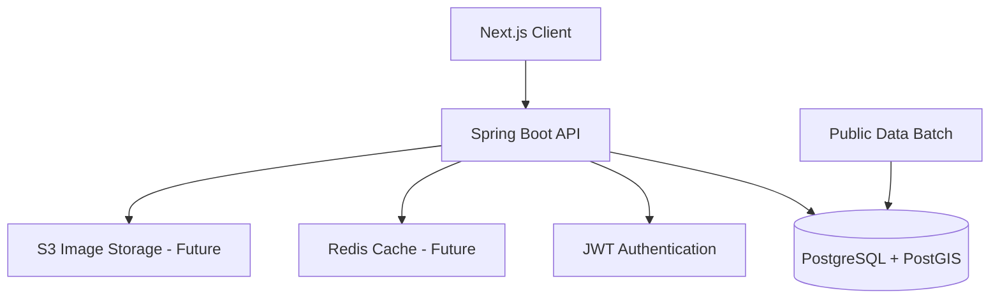
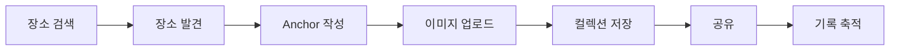

# DATT v2 아키텍처 설계 및 도메인 구조 분석

# 프로젝트 개요

DATT는:

> "공간에 기억을 남기는 위치 기반 기록 플랫폼"

을 목표로 하는 서비스다.

사용자는:

- 장소 검색
    
- 지도 탐색
    
- Anchor 기록
    
- 이미지 업로드
    
- 리뷰 작성
    
- 장소 저장 및 공유
    

등의 기능을 수행할 수 있다.

---

# 기존 구조의 문제점

기존 DATT는:

```text
실시간 크롤링 기반 장소 탐색 구조
```

에 가까웠다.

초기 구조:

```text
Client
    ↓
Spring Boot
    ↓
FastAPI Crawling Engine
    ↓
External Sources
    ↓
PostgreSQL
```

하지만 다음과 같은 문제가 존재했다.

---

# 기존 구조의 한계

## 1. 외부 서비스 의존성

- 실시간 크롤링 구조
    
- 외부 응답 지연
    
- 데이터 품질 불안정
    

---

## 2. 서비스 정체성 문제

기존 구조는:

```text
장소 검색 플랫폼
```

방향으로 확장될 위험이 존재했다.

하지만 DATT의 핵심은:

```text
장소 검색
```

이 아니라:

```text
장소 기반 기록 및 공유
```

이다.

---

## 3. 운영 리스크

- 크롤링 실패
    
- 응답 지연
    
- 외부 구조 변경
    
- 무한 데이터 범위
    

문제가 존재했다.

---

# DATT v2 핵심 방향

DATT v2에서는:

```text
외부 포털 데이터 의존 제거
```

를 핵심 방향으로 잡는다.

즉:

```text
공공데이터 = 장소 기본 정보

DATT 내부 데이터 = 장소 가치 데이터
```

구조로 변경한다.

---

# 핵심 설계 원칙

# 1. 장소 자체보다 기록이 중요하다

DATT는:

```text
맛집 플랫폼
```

이 아니라:

```text
기억 기록 플랫폼
```

이어야 한다.

따라서:

- Anchor
    
- 이미지
    
- 리뷰
    
- 컬렉션
    

등 사용자 활동이 핵심 도메인이 된다.

---

# 2. 장소는 공공데이터 기반으로 관리한다

장소 데이터는:

```text
공공데이터 기반 Place
```

를 사용한다.

즉:

- 장소명
    
- 좌표
    
- 주소
    
- 카테고리
    

등의 기본 정보는 공공데이터 기반으로 제공한다.

---

# 3. 장소의 가치는 내부 데이터로 성장한다

DATT 내부 데이터:

- Anchor 수
    
- 리뷰 수
    
- 이미지 수
    
- 저장 수
    
- 공유 수
    

를 기반으로 장소의 가치가 형성된다.

즉:

```text
DATT 내부 활동이 장소를 성장시킨다
```

구조다.

---

# 전체 아키텍처 구조



---

# 기술 스택

# Frontend

```text
Next.js 14
TypeScript
Tailwind
shadcn/ui
zustand
tanstack-query
```

---

# Backend

```text
Spring Boot 3.x
Java 17
Spring Security
JWT
JPA
Flyway
```

---

# Database

```text
PostgreSQL
PostGIS
Redis (추후)
```

---

# Infra

```text
Docker
Docker Compose
Nginx
```

---

# 핵심 도메인 구조

# 1. Member Domain

사용자 관련 도메인.

포함 기능:

- 회원가입
    
- 로그인
    
- JWT 인증
    
- 프로필
    
- 레벨/칭호
    

---

# 2. Place Domain

공공데이터 기반 장소 도메인.

포함 기능:

- 장소 검색
    
- 카테고리 조회
    
- 지도 조회
    
- place_group 관리
    

---

# 3. Anchor Domain

DATT 핵심 도메인.

포함 기능:

- Anchor 작성
    
- 이미지 업로드
    
- 공개 범위 설정
    

---

# 4. Review Domain

내부 리뷰 및 평점 관리.

포함 기능:

- 리뷰 작성
    
- 평점 작성
    
- 장소별 리뷰 조회
    

---

# 5. Collection Domain

장소 저장 및 공유.

포함 기능:

- 장소 컬렉션 생성
    
- 장소 저장
    
- 공유 링크 생성
    

---

# 6. Gamification Domain

기록 기반 성장 시스템.

포함 기능:

- 경험치
    
- 레벨
    
- 칭호
    
- 배지
    

---

# place vs place_group

DATT v2에서는:

```text
place
```

와

```text
place_group
```

를 분리한다.

---

# place

공공데이터 원본 장소.

예:

```text
스타벅스 성수점
스타벅스 성수역점
스타벅스 성수 DT점
```

---

# place_group

사용자에게 보여줄 대표 장소 단위.

즉:

```text
사용자 경험 중심 장소 단위
```

다.

---

# 장소 가치 계산 구조

외부 평점/리뷰는 사용하지 않는다.

모든 점수는:

```text
DATT 내부 활동 데이터
```

기반이다.

---

# 인기 점수 예시

```text
popular_score =
    anchor_count * 0.30
    + review_count * 0.25
    + image_count * 0.20
    + save_count * 0.15
    + share_count * 0.10
```

현재는 설계 가설이며,  
실제 데이터 기반 조정 예정이다.

---

# 게임화 방향

DATT의 게임화는:

```text
경쟁 중심
```

이 아니라:

```text
기록 축적 중심
```

이다.

예시:

- 성수 기록가
    
- 심야 탐험가
    
- Anchor Keeper
    

---

# UI/UX 방향

DATT는:

```text
지도 서비스
```

가 아니라:

```text
지도 기반 기록 플랫폼
```

방향으로 설계한다.

---

# 핵심 UX 흐름



---

# 운영 관점 고려 사항

# 1. 공공데이터 업데이트 정책

정기 배치 기반으로:

- 신규 장소
    
- 수정 장소
    
- 삭제 장소
    

를 관리한다.

---

# 2. 로그 관리

필수 로그:

- traceId
    
- request duration
    
- memberId
    
- error logging
    

---

# 3. 성능 고려

추후 적용 예정:

- Redis 캐싱
    
- 지도 bounds 조회 최적화
    
- PostGIS Index
    
- 인기 점수 배치 계산
    

---

# Trade-off

# 장점

|장점|
|---|
|외부 서비스 의존 제거|
|내부 데이터 기반 성장 구조|
|서비스 정체성 강화|
|운영 안정성 향상|
|장소 기록 중심 UX 가능|

---

# 단점

|단점|
|---|
|초기 데이터 부족|
|초기 리뷰/이미지 부족|
|사용자 활동 의존성 증가|
|인기 장소 형성까지 시간 필요|

---

# 왜 이런 구조를 선택했는가?

기존에는:

```text
외부 장소 데이터 중심 구조
```

였다.

하지만 이는:

- 외부 의존성
    
- 운영 리스크
    
- 데이터 무한 확장
    

문제를 발생시켰다.

따라서 DATT v2에서는:

```text
장소 데이터 플랫폼
```

이 아니라:

```text
공간 기반 기록 플랫폼
```

방향으로 재정의했다.

---

# 앞으로의 방향

DATT v2의 핵심은:

```text
사용자의 기록이 장소를 완성한다
```

는 구조다.

즉:

- Anchor
    
- 이미지
    
- 리뷰
    
- 컬렉션
    

이 쌓이면서 장소의 가치가 성장한다.

---

# 마무리

DATT v2는 단순 장소 검색 서비스가 아니다.

핵심은:

```text
공간에 기억을 남기고
그 기록이 축적되는 경험
```

이다.

앞으로는:

- 운영 안정성
    
- 내부 데이터 기반 성장
    
- 기록 중심 UX
    
- 사용자 아카이브 경험
    

을 중심으로 서비스를 고도화할 예정이다.