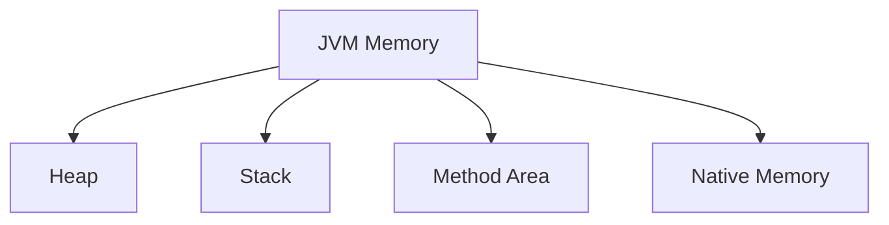
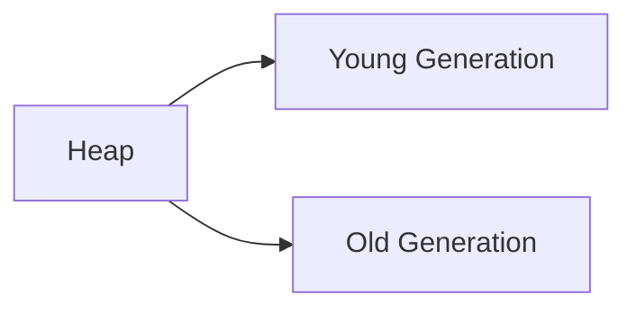
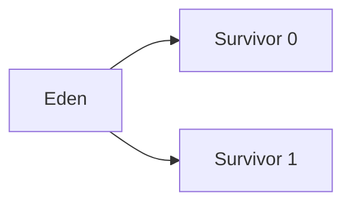
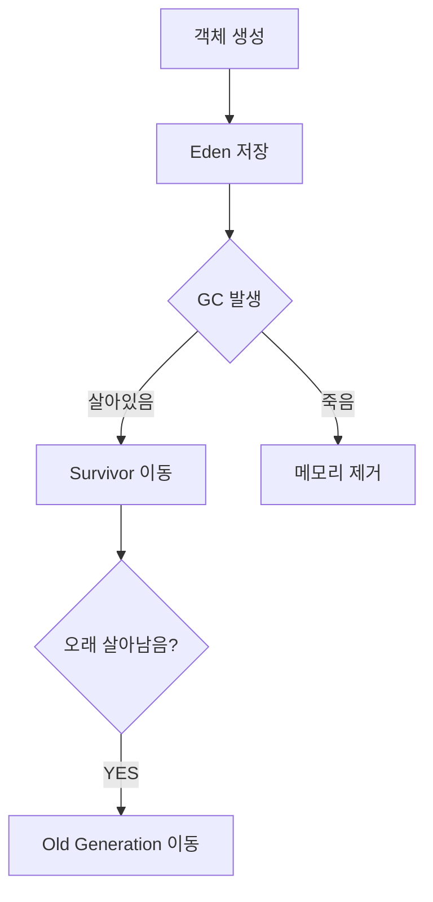
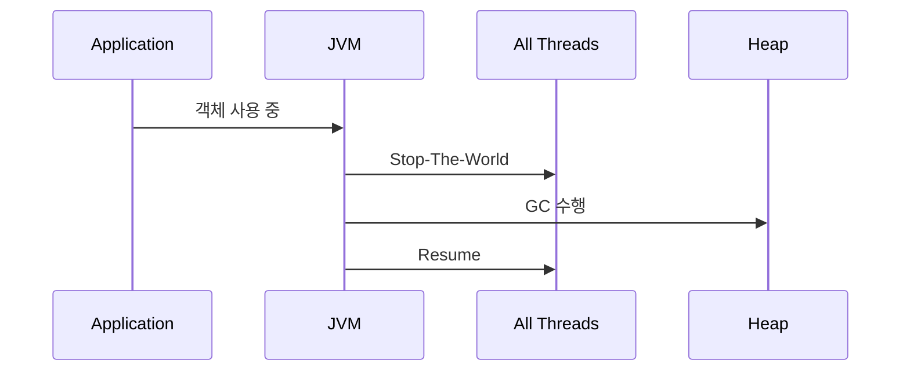
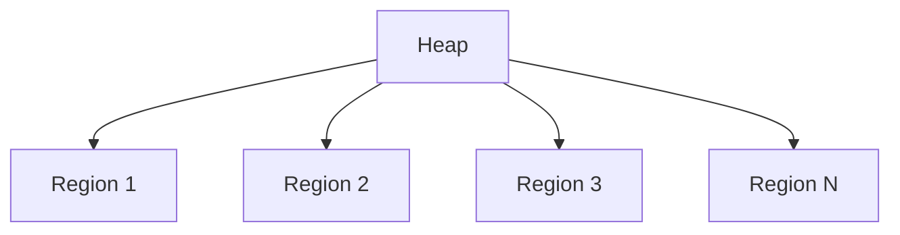

# JVM GC와 메모리 관리

# 학습 목표

이번 주제의 핵심은 단순히:

> "GC는 안 쓰는 객체를 제거하는 기능"

수준이 아니다.

실무에서는 다음을 이해해야 한다.

- 왜 GC가 필요한가?
    
- JVM은 왜 Heap을 세대별로 나누는가?
    
- Minor GC와 Major GC 차이는 무엇인가?
    
- Stop-The-World는 왜 발생하는가?
    
- G1GC는 왜 등장했는가?
    
- 메모리 누수는 왜 발생하는가?
    
- 운영 환경에서 GC는 어떻게 장애가 되는가?
    

즉:

> "Java 메모리 관리 시스템 전체"

를 이해하는 것이 목표다.

---

# JVM 메모리 구조 복습



이번 핵심은 Heap 영역이다.

---

# Heap 구조

Heap은 객체 저장 영역이다.



---

# 왜 Heap을 나눴는가?

핵심 이유:

> "대부분 객체는 금방 죽는다"

라는 경험적 통계 때문이다.

예:

- HTTP Request 객체
    
- DTO
    
- StringBuilder
    
- 임시 Collection
    

대부분 요청 처리 후 바로 제거된다.

즉:

짧게 사는 객체와 오래 사는 객체를 분리하면 GC 효율이 올라간다.

---

# Young Generation 구조



---

# 객체 생성 흐름



---

# Minor GC

Young Generation 대상으로 수행.

특징:

- 빠름
    
- 자주 발생
    
- 대부분 객체 제거 가능
    

왜 빠를까?

> 대부분 객체가 이미 죽어있기 때문

이다.

---

# Stop-The-World(STW)

GC 시 JVM은 애플리케이션 Thread를 멈춘다.



---

# 왜 멈춰야 하는가?

GC는:

> "현재 어떤 객체가 살아있는가?"

를 정확히 알아야 한다.

그런데 Thread가 계속 객체를 변경하면:

- 참조 관계 변경
    
- 객체 생성
    
- 객체 삭제
    

가 계속 발생한다.

즉:

> 메모리 상태가 계속 바뀐다.

그래서 안전한 분석을 위해 잠시 멈춘다.

---

# 실무에서 STW가 위험한 이유

예:

- API 응답 지연
    
- Timeout 증가
    
- TPS 감소
    
- 장애 전파
    

특히 대용량 서비스에서:

```text
STW 5초
```

같은 상황은 치명적이다.

---

# Old Generation

오래 살아남은 객체 저장 영역.

대표:

- Cache
    
- Singleton Bean
    
- Session
    
- 장기 유지 Collection
    

---

# Major GC / Full GC

Old Generation 대상 GC.

특징:

- 느림
    
- STW 길어짐
    
- 시스템 영향 큼
    

---

# 왜 느린가?

Old 영역 객체는:

- 크고
    
- 참조 관계 복잡하고
    
- 살아있는 객체 비율 높다
    

즉:

GC 탐색 비용이 매우 커진다.

---

# 실제 운영 장애 사례

```text
Full GC 발생
→ STW 10초
→ API Timeout
→ 장애 전파
```

실제 현업에서 매우 흔한 장애 패턴이다.

---

# G1GC 등장 배경

기존 GC 문제:

- Heap 커질수록 Full GC 길어짐
    
- 예측 불가능한 STW
    

이를 해결하려고 등장.

---

# G1GC 구조

Heap을 Region 단위로 나눈다.



---

# 왜 좋은가?

기존:

> Heap 전체 GC

G1GC:

> 필요한 Region 우선 GC

즉:

- pause time 예측 가능
    
- 대용량 Heap 대응 가능
    

---

# G1GC 핵심 철학

> "GC Throughput"보다  
> "Pause Time 제어"

를 더 중요하게 본다.

실무에서 이게 매우 중요하다.

왜냐면:

사용자는 TPS보다:

> 응답 지연(latency)

에 민감하기 때문이다.

---

# GC Root

GC는 객체 생존 여부를:

> "GC Root에서 도달 가능한가?"

로 판단한다.

대표 GC Root:

- Stack 지역 변수
    
- static 변수
    
- Thread
    
- JNI 참조
    

---

# 메모리 누수(Memory Leak)

Java도 메모리 누수가 발생한다.

많이 오해하는 부분이다.

---

# 왜 발생하는가?

Java에서 leak은:

> "사용 안 하지만 참조가 남아있는 객체"

다.

즉:

GC 대상이 안 된다.

---

# 대표 사례

## 1. static Collection

```java
private static List<Object> cache =
    new ArrayList<>();
```

계속 추가만 하면 영원히 살아있다.

---

## 2. ThreadLocal Leak

실무 단골.

```java
ThreadLocal<User> local =
    new ThreadLocal<>();
```

remove() 안 하면 Thread Pool 환경에서 누수 가능.

---

## 3. Cache 무한 증가

```java
Map<String, Object> cache
```

eviction 없으면 위험.

---

# 운영에서 중요한 GC 로그

실무에서는 GC 로그를 반드시 본다.

대표 확인 항목:

- STW 시간
    
- Young GC 빈도
    
- Full GC 빈도
    
- Heap 사용량
    
- Promotion 실패
    

---

# 예시 로그

```text
Pause Young (G1 Evacuation Pause)
35ms
```

---

# 성능 관점

GC 핵심 목표:

- Throughput
    
- Latency
    
- Memory Footprint
    

이 셋은 Trade-off 관계다.

---

# Trade-off

## Heap 크게 설정

장점:

- GC 빈도 감소
    

단점:

- Full GC 길어짐
    

---

## Heap 작게 설정

장점:

- pause 짧음
    

단점:

- GC 자주 발생
    

---

## G1GC 사용

장점:

- pause 예측 가능
    

단점:

- CPU 사용량 증가 가능
    

---

# 자주 발생하는 실수

## 1. Heap만 무조건 크게 설정

운영 장애 원인 가능.

---

## 2. Cache 무한 증가

매우 흔함.

---

## 3. ThreadLocal remove 누락

실무 단골 장애.

---

## 4. Full GC 무시

장애 전조 신호 놓침.

---

# 면접 꼬리 질문

## Q1. 왜 Young/Old 영역을 나누는가?

핵심:

> 대부분 객체는 빨리 죽기 때문

---

## Q2. Stop-The-World는 왜 필요한가?

핵심:

- 객체 참조 안정성 확보
    
- GC 정확성 보장
    

---

## Q3. Full GC가 위험한 이유는?

핵심:

- 긴 STW
    
- 서비스 응답 지연
    
- 장애 전파
    

---

## Q4. Java도 메모리 누수가 발생하는가?

핵심:

> 참조가 남아있으면 GC되지 않는다.

---

## Q5. G1GC는 왜 등장했는가?

핵심:

- 대용량 Heap 대응
    
- Pause Time 예측 가능성 확보
    

---

# 좋은 답변 예시

> JVM은 객체 수명 특성을 이용하기 위해 Heap을 Young/Old 영역으로 분리합니다.  
> 대부분 객체는 빠르게 제거되므로 Young GC는 매우 효율적입니다.  
> 반면 Old 영역 GC는 STW 시간이 길어 실제 운영 장애 원인이 될 수 있습니다.  
> 이를 해결하기 위해 G1GC 같은 Region 기반 GC가 등장했으며, 최근 JVM은 Throughput보다 Latency 안정성을 중요하게 보는 방향으로 발전하고 있습니다.

---

# 관련 CS 개념 연결

- Garbage Collection
    
- Reachability Analysis
    
- Memory Management
    
- Runtime System
    
- Stop-The-World
    
- Latency vs Throughput
    
- Generational Hypothesis
    

---

# 현업에서 특히 중요한 포인트

## 1. GC는 운영 장애 원인이다

단순 CS 이론이 아니다.

---

## 2. Full GC는 반드시 추적해야 한다

장애 전조일 가능성 높다.

---

## 3. ThreadLocal Leak 매우 흔하다

특히 Spring + Thread Pool 환경.

---

## 4. Latency 관점이 중요하다

실무는 TPS보다 응답 지연이 중요할 때 많다.

---

# 핵심 요약

- JVM은 객체 수명 특성을 이용해 세대별 GC 수행
    
- Minor GC는 빠르고 Major GC는 위험하다
    
- Stop-The-World는 GC 정확성을 위한 구조
    
- G1GC는 Pause Time 제어를 위해 등장
    
- Java도 메모리 누수가 발생한다
    
- GC는 실제 운영 장애와 매우 밀접하다
    
- 실무에서는 GC 로그 분석 능력이 중요하다