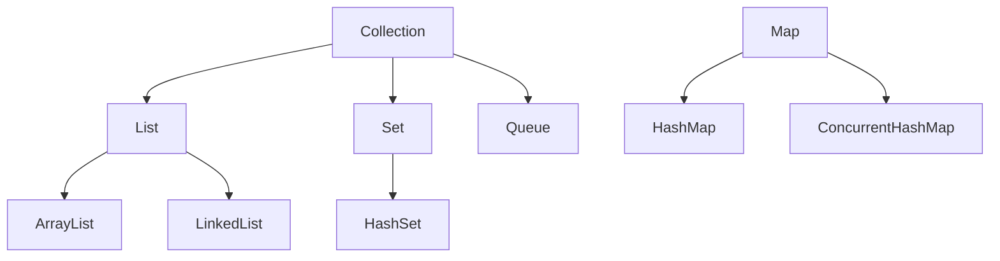
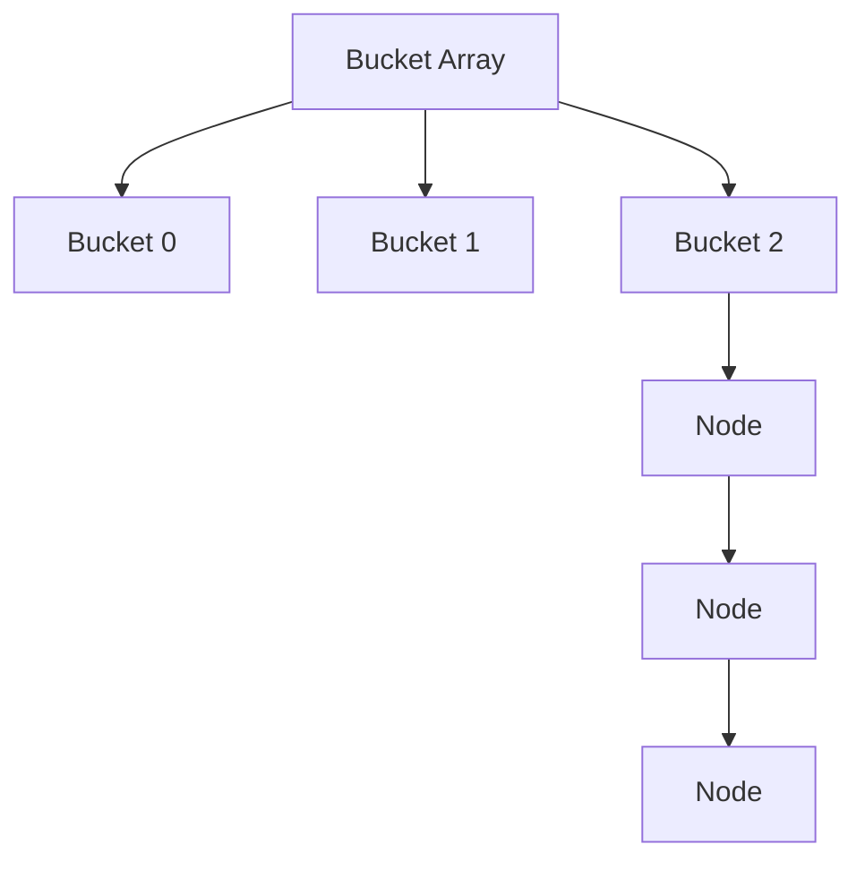
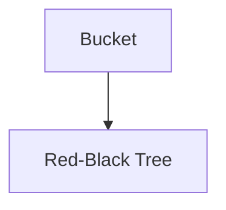
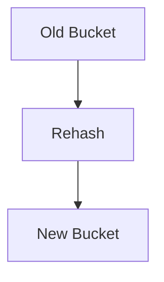
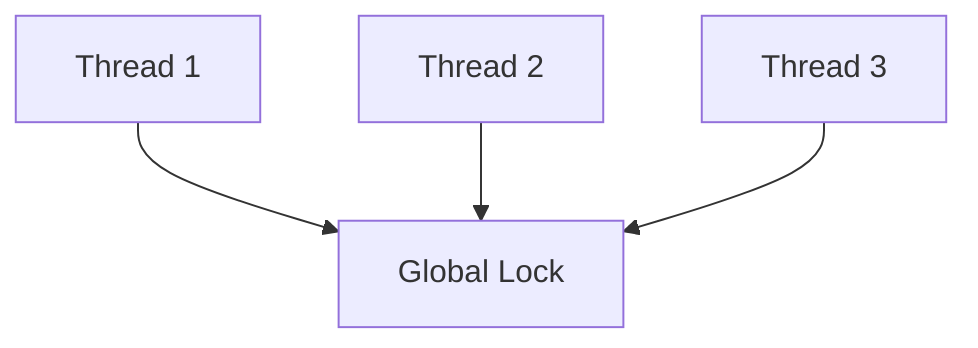
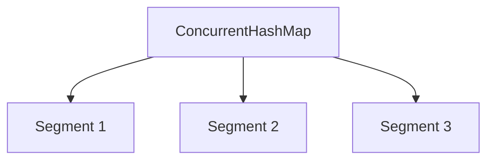
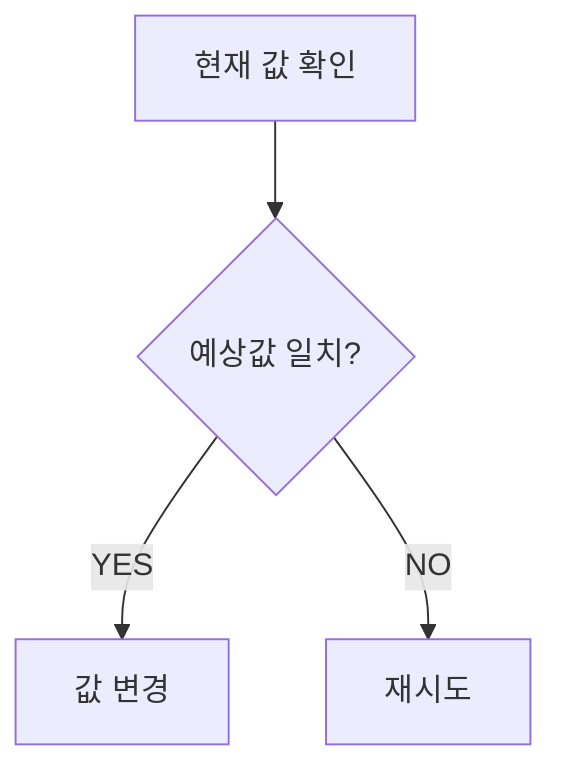

# Java Collection Framework와 HashMap 내부 구조

# 학습 목표

이번 주제의 핵심은 단순히:

> "HashMap은 Key-Value 저장 자료구조"

수준이 아니다.

실무에서는 다음을 이해해야 한다.

- HashMap은 왜 빠른가?
    
- collision은 왜 발생하는가?
    
- resize는 왜 위험한가?
    
- load factor는 왜 존재하는가?
    
- ConcurrentHashMap은 왜 필요한가?
    
- CAS는 왜 등장했는가?
    
- 멀티스레드 환경에서 어떤 장애가 발생하는가?
    

즉:

> Java Collection 내부 동작과 동시성 설계 철학

을 이해하는 것이 목표다.

---

# Java Collection Framework 구조



---

# HashMap 핵심 구조

HashMap은 내부적으로:

> 배열 + LinkedList + Tree

구조를 사용한다.

---

# 기본 구조



---

# 왜 빠른가?

HashMap 핵심은:

> hash 값을 이용해 index 직접 접근

하는 것이다.

예:

```java
index = hash(key) % bucketSize
```

즉:

배열 탐색처럼 동작한다.

평균 시간 복잡도:

```text
O(1)
```

---

# collision이란?

서로 다른 key가:

> 같은 bucket index

로 들어가는 현상.

예:

```text
"A" -> bucket 3
"B" -> bucket 3
```

---

# 왜 collision이 발생하는가?

Hash 공간은 제한적이다.

하지만 key는 무한히 들어올 수 있다.

즉:

> 완벽한 hash는 현실적으로 불가능

하다.

---

# collision 처리 방식

JDK 7:

- LinkedList 사용
    

JDK 8 이후:

- 일정 길이 이상이면 Tree 변환
    

---

# JDK8 Tree 구조 도입



---

# 왜 Tree를 도입했는가?

LinkedList collision 심해지면:

```text
O(n)
```

까지 성능 저하 발생.

특히 악의적 hash collision 공격 가능.

Tree 사용 시:

```text
O(log n)
```

보장 가능.

---

# resize란?

Bucket 크기 증가 작업.

예:

```text
16 → 32 → 64
```

---

# 왜 resize가 필요한가?

Bucket이 부족하면 collision 증가.

즉:

성능 급격히 저하.

---

# load factor란?

기본값:

```text
0.75
```

의미:

```text
(size / bucket capacity)
```

---

# 왜 0.75인가?

Trade-off 때문이다.

---

# load factor 낮으면

장점:

- collision 감소
    

단점:

- 메모리 낭비
    

---

# load factor 높으면

장점:

- 메모리 효율
    

단점:

- collision 증가
    

---

# resize는 왜 위험한가?

resize는:

> 모든 데이터를 재배치(rehash)

한다.



즉:

비용이 매우 크다.

---

# 실무에서 중요한 이유

대량 데이터 insert 시:

- CPU spike
    
- latency 증가
    
- STW 증가 가능
    

즉:

대용량 서비스에서 resize는 실제 성능 이슈다.

---

# HashMap은 Thread Safe한가?

아니다.

매우 중요하다.

---

# 왜 위험한가?

멀티스레드 환경에서:

- 동시 put
    
- resize 충돌
    
- 데이터 유실
    

발생 가능.

---

# 과거 JDK7 resize 문제

멀티스레드 resize 시:

```text
무한 루프
CPU 100%
```

문제가 실제 있었다.

유명한 면접 질문이다.

---

# 왜 발생했는가?

resize 중 LinkedList 방향 꼬임 발생.

즉:

> concurrent modification 문제

였다.

---

# synchronized Map 문제

```java
Collections.synchronizedMap(map)
```

가능은 하다.

하지만:

> 전체 lock

이다.

---

# 문제점



즉:

동시성 성능이 매우 떨어진다.

---

# ConcurrentHashMap 등장

목표:

> Thread Safe + 높은 동시성

---

# JDK7 ConcurrentHashMap

Segment 기반.



Segment별 lock 사용.

---

# JDK8 ConcurrentHashMap

더 발전했다.

핵심:

- CAS
    
- synchronized 최소화
    
- bucket 단위 locking
    

---

# CAS란?

Compare And Swap.



---

# 왜 중요한가?

기존 lock 방식:

```text
Thread Blocking
```

발생.

CAS는:

> lock 없이 원자적 연산 수행

가능.

---

# Atomic 클래스도 CAS 사용

예:

```java
AtomicInteger
AtomicLong
```

---

# CAS 문제점

완벽하지 않다.

---

# 1. Spin 문제

실패 시 계속 재시도.

CPU 사용량 증가 가능.

---

# 2. ABA 문제

값이:

```text
A → B → A
```

변경돼도 감지 못할 수 있음.

---

# ConcurrentHashMap 핵심 철학

> "lock을 최대한 줄인다"

이다.

실무에서는 이게 매우 중요하다.

---

# 실무 사용 사례

대표적으로:

- Cache
    
- Session 저장
    
- 동시 요청 상태 관리
    
- API Rate Limiting
    

등에 많이 사용.

---

# 성능 관점

HashMap:

- 단일 Thread 최고 성능
    

ConcurrentHashMap:

- 멀티 Thread 최적화
    

즉:

상황에 따라 다르다.

---

# Trade-off

## HashMap

장점:

- 빠름
    
- 단순
    

단점:

- Thread Unsafe
    

---

## synchronizedMap

장점:

- 구현 쉬움
    

단점:

- 전체 lock
    

---

## ConcurrentHashMap

장점:

- 높은 동시성
    
- lock 최소화
    

단점:

- 내부 구조 복잡
    
- 메모리 사용 증가 가능
    

---

# 자주 발생하는 실수

## 1. HashMap을 멀티스레드에서 사용

실무 장애 매우 흔함.

---

## 2. resize 비용 무시

대량 insert 시 위험.

---

## 3. ConcurrentHashMap이면 무조건 안전하다고 착각

복합 연산은 여전히 위험.

예:

```java
if(map.get(key) == null) {
    map.put(key, value);
}
```

race condition 가능.

---

# 면접 꼬리 질문

## Q1. HashMap은 왜 빠른가?

핵심:

- hash 기반 index 접근
    
- 평균 O(1)
    

---

## Q2. collision은 왜 발생하는가?

핵심:

- 제한된 bucket 공간
    
- hash 충돌 불가피
    

---

## Q3. JDK8에서 Tree 구조를 도입한 이유는?

핵심:

- collision 성능 개선
    
- O(log n) 보장
    

---

## Q4. ConcurrentHashMap은 어떻게 동시성을 개선했는가?

핵심:

- CAS
    
- lock 최소화
    
- bucket 단위 동기화
    

---

## Q5. CAS란 무엇인가?

핵심:

- lock-free atomic 연산
    

---

# 좋은 답변 예시

> HashMap은 hash 기반 bucket index 접근을 통해 평균 O(1)의 성능을 제공합니다.  
> 하지만 collision 문제와 resize 비용이 존재하며 멀티스레드 환경에서는 Thread Safe하지 않습니다.  
> 이를 해결하기 위해 ConcurrentHashMap이 등장했으며 JDK8 이후에는 CAS와 fine-grained locking을 이용해 높은 동시성을 제공합니다.  
> 다만 CAS 역시 spin과 ABA 같은 Trade-off를 가집니다.

---

# 관련 CS 개념 연결

- Hash Table
    
- Collision Resolution
    
- Red-Black Tree
    
- Compare-And-Swap
    
- Lock-Free Algorithm
    
- Race Condition
    
- Concurrent Programming
    

---

# 현업에서 특히 중요한 포인트

## 1. HashMap은 절대 Thread Safe하지 않다

실무 장애 매우 흔하다.

---

## 2. resize는 비용이 크다

대량 데이터 처리 시 중요.

---

## 3. CAS 이해는 매우 중요하다

Concurrent 프로그래밍 핵심.

---

## 4. ConcurrentHashMap도 완벽하지 않다

복합 연산은 여전히 주의 필요.

---

# 핵심 요약

- HashMap은 hash 기반 자료구조다
    
- collision은 필연적으로 발생한다
    
- JDK8부터 Tree 구조로 성능 개선
    
- resize는 매우 비싼 작업이다
    
- HashMap은 Thread Safe하지 않다
    
- ConcurrentHashMap은 CAS 기반으로 동시성을 개선했다
    
- CAS도 spin/ABA 같은 Trade-off를 가진다
    
- 실무에서는 동시성 문제 이해가 매우 중요하다