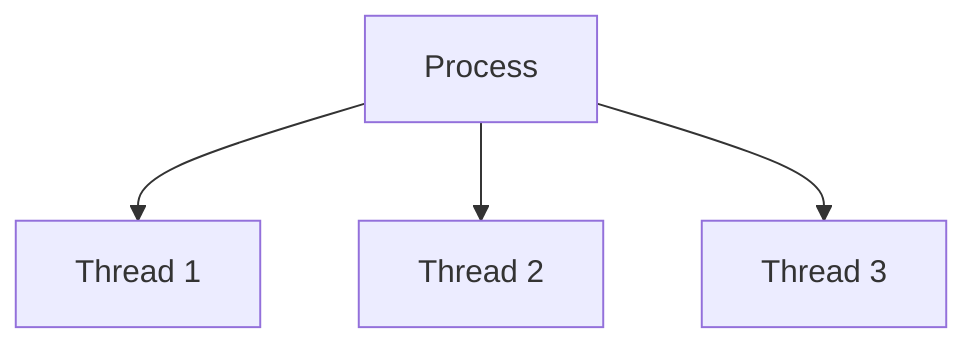
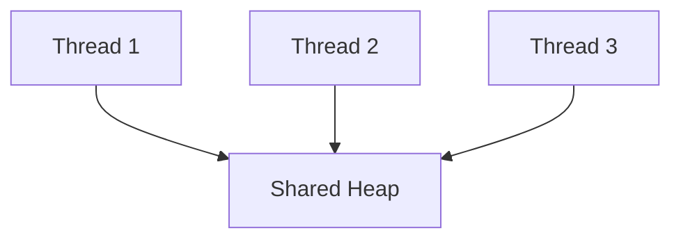
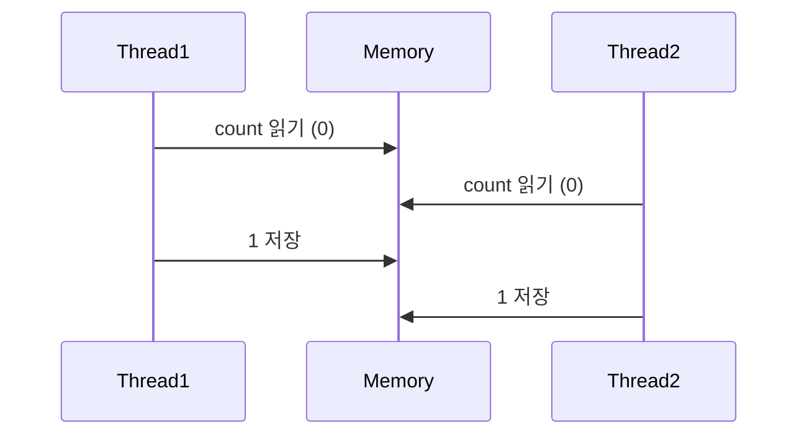
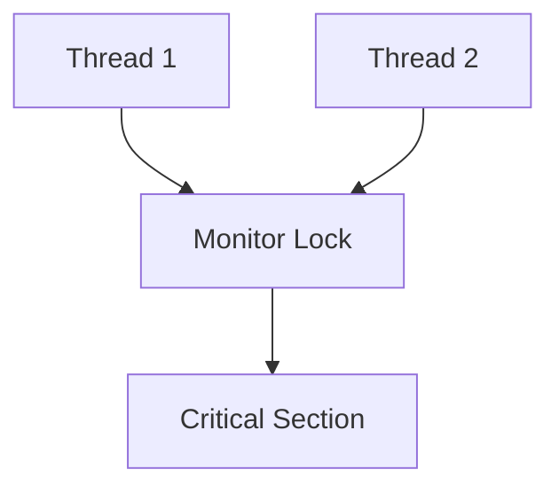
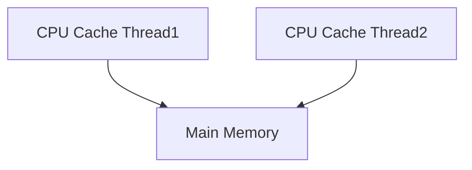
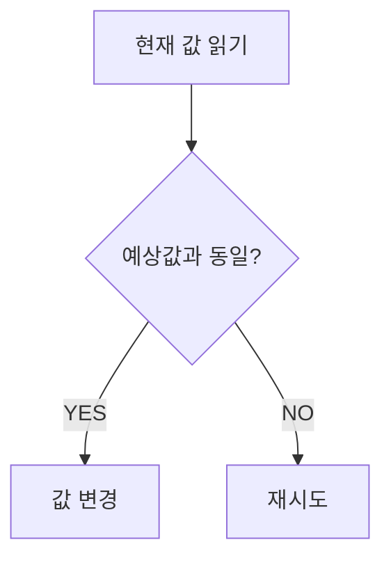
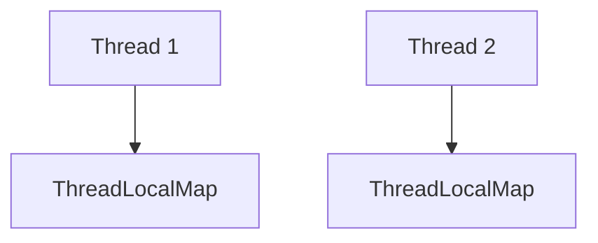
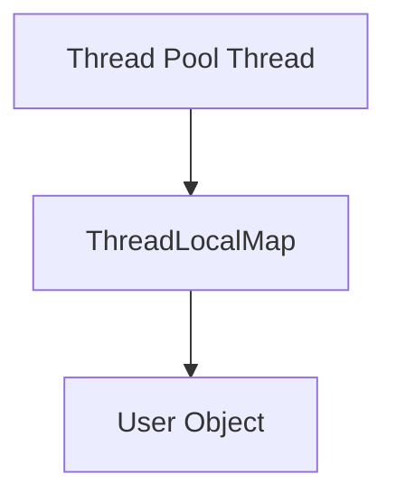

# Java Thread, synchronized, volatile, Atomic

# 학습 목표

이번 주제의 핵심은 단순히:

> "멀티스레드는 동시에 실행된다"

수준이 아니다.

실무에서는 반드시 아래를 설명할 수 있어야 한다.

- Race Condition은 왜 발생하는가?
    
- synchronized는 정확히 무엇을 보장하는가?
    
- volatile은 왜 필요한가?
    
- Atomic은 어떻게 lock 없이 동작하는가?
    
- CAS는 왜 등장했는가?
    
- ThreadLocal은 왜 메모리 누수를 유발하는가?
    
- 운영 환경에서 동시성 문제는 어떻게 장애가 되는가?
    

즉:

> Java 동시성 모델과 메모리 가시성 문제

를 이해하는 것이 핵심이다.

---

# 먼저 가장 중요한 개념

멀티스레드 문제의 핵심은:

> "여러 스레드가 같은 데이터를 동시에 접근"

하는 것이다.

---

# Thread란?

Thread는:

> 프로세스 내부 실행 흐름

이다.

예:



---

# 중요한 특징

Thread들은:

- Heap 공유
    
- Method Area 공유
    

한다.

반면:

- Stack은 개별 보유
    

한다.

---

# 왜 위험한가?

Heap은 공유 메모리다.

즉:



동시에 같은 객체 접근 가능.

---

# Race Condition

가장 중요한 개념.

Race Condition은:

> 실행 순서에 따라 결과가 달라지는 문제

다.

---

# 예시

```java
count++;
```

겉보기엔 1줄이다.

하지만 실제 CPU 수준에서는:

```text
1. 값 읽기
2. +1 수행
3. 다시 저장
```

3단계다.

---

# 왜 문제인가?

예:



결과:

```text
원래 기대값 = 2
실제 결과 = 1
```

즉:

> 데이터 유실

발생.

---

# synchronized

Java 기본 동기화 방식.

```java
public synchronized void increase() {
    count++;
}
```

---

# synchronized 핵심

핵심은:

> "한 번에 하나의 Thread만 접근"

이다.

---

# 내부 동작



---

# Monitor Lock이란?

Java 객체 내부에는:

```text
Monitor
```

라는 lock 메커니즘 존재.

synchronized는 이 Monitor 사용.

---

# synchronized가 보장하는 것

## 1. Mutual Exclusion

동시 접근 방지.

---

## 2. Memory Visibility

변경 사항 메모리 동기화.

이게 매우 중요하다.

---

# synchronized 문제점

## 1. Thread Blocking

lock 기다리며 대기.

---

## 2. Context Switching 비용

CPU overhead 발생.

---

## 3. 성능 저하 가능

경쟁 심하면 throughput 감소.

---

# volatile

volatile은 매우 자주 오해된다.

---

# volatile 핵심

volatile은:

> "변수 최신값 보장"

이다.

---

# 왜 필요한가?

CPU는 성능 향상을 위해:

- CPU Cache
    
- Register Cache
    

사용한다.

---

# 문제 상황



Thread마다 cache 값 다를 수 있음.

---

# 예시

```java
private boolean running = true;
```

Thread1:

```java
while(running) {
}
```

Thread2:

```java
running = false;
```

---

# 문제

Thread1이 CPU cache 값 계속 볼 수 있음.

즉:

```text
무한 루프 가능
```

---

# volatile 사용

```java
private volatile boolean running;
```

---

# volatile이 보장하는 것

## 1. Memory Visibility

최신값 읽기 보장.

---

# volatile이 보장하지 않는 것

## Atomicity

이거 엄청 중요하다.

---

# 즉 이건 위험하다

```java
volatile int count;

count++;
```

여전히 race condition 가능.

왜냐면:

```text
read → modify → write
```

는 atomic하지 않다.

---

# Atomic 클래스

대표:

```java
AtomicInteger
AtomicLong
AtomicReference
```

---

# 핵심 철학

> lock 없이 원자적 연산 수행

이다.

---

# CAS(Compare And Swap)

Atomic 핵심 메커니즘.

---

# CAS 동작 흐름



---

# 예시

```java
AtomicInteger count =
    new AtomicInteger();

count.incrementAndGet();
```

---

# 왜 빠른가?

기존 synchronized:

```text
Thread Blocking
```

발생.

CAS는:

> lock-free 방식

가능.

---

# CAS 문제점

## 1. Spin 문제

실패 시 계속 재시도.

CPU 사용량 증가 가능.

---

## 2. ABA 문제

```text
A → B → A
```

변경돼도 감지 못할 수 있음.

---

# synchronized vs Atomic

## synchronized

장점:

- 구현 단순
    
- 복잡한 동기화 가능
    

단점:

- blocking 발생
    

---

## Atomic

장점:

- 빠름
    
- lock-free
    

단점:

- 복잡한 연산 한계
    

---

# ThreadLocal

실무에서 엄청 중요하다.

---

# ThreadLocal 핵심

> Thread마다 독립 변수 제공

이다.

---

# 예시

```java
ThreadLocal<User> local =
    new ThreadLocal<>();
```

---

# 왜 쓰는가?

대표:

- 사용자 정보
    
- Transaction Context
    
- 로그 추적
    
- 인증 정보
    

---

# Spring에서도 많이 사용

대표:

- SecurityContextHolder
    
- TransactionSynchronizationManager
    

---

# ThreadLocal 구조



---

# 왜 Memory Leak 발생하나?

핵심:

> Thread Pool 때문

이다.

---

# 문제 상황

Thread Pool Thread는:

```text
죽지 않고 재사용
```

된다.

---

# 그런데 remove 안 하면?

```java
threadLocal.set(user);
```

만 하고:

```java
remove()
```

안 하면 값 계속 남는다.

---

# 결과



객체 GC 안 됨.

---

# 실제 운영 장애 사례

```text
Heap 증가
→ Full GC 증가
→ OOM 발생
```

특히:

- Tomcat
    
- Spring MVC
    
- Async 처리
    

환경에서 흔하다.

---

# 실무에서 중요한 동시성 문제

대표 사례:

- 주문 중복 생성
    
- 재고 음수
    
- 중복 결제
    
- 캐시 오염
    

---

# 실전 예시

```text
재고 1개

Thread1 구매
Thread2 구매
```

둘 다 성공 가능.

---

# 왜 어려운가?

동시성 문제는:

> "가끔만 발생"

한다.

즉:

- 재현 어려움
    
- 테스트 어려움
    
- 운영에서만 터짐
    

매우 위험하다.

---

# 성능 관점

동기화는 항상 Trade-off 존재.

---

# lock 많이 사용

장점:

- 안전성 증가
    

단점:

- throughput 감소
    

---

# lock 줄이면

장점:

- 성능 향상
    

단점:

- race condition 위험
    

---

# 자주 발생하는 실수

## 1. volatile이면 안전하다고 착각

Atomicity 보장 안 함.

---

## 2. HashMap 멀티 Thread 사용

실무 장애 흔함.

---

## 3. ThreadLocal remove 누락

메모리 leak 발생.

---

## 4. synchronized 남용

성능 병목 가능.

---

# 면접 꼬리 질문

## Q1. synchronized는 무엇을 보장하나요?

핵심:

- mutual exclusion
    
- visibility
    

---

## Q2. volatile은 왜 필요한가요?

핵심:

- CPU cache visibility 문제 해결
    

---

## Q3. volatile이 atomicity를 보장하나요?

정답:

- 아니다
    

---

## Q4. CAS란 무엇인가요?

핵심:

- lock-free atomic operation
    

---

## Q5. ThreadLocal leak은 왜 발생하나요?

핵심:

- Thread Pool 재사용
    
- remove 누락
    

---

# 좋은 답변 예시

> Java Thread는 Heap 메모리를 공유하기 때문에 Race Condition 문제가 발생할 수 있습니다.  
> synchronized는 Monitor Lock을 통해 mutual exclusion과 memory visibility를 보장합니다.  
> volatile은 최신값 visibility만 보장하며 atomicity는 보장하지 않습니다.  
> Atomic 클래스는 CAS 기반 lock-free 방식으로 동작하며 ThreadLocal은 Thread Pool 환경에서 remove 누락 시 메모리 leak을 유발할 수 있습니다.

---

# 관련 CS 개념 연결

- Race Condition
    
- Memory Visibility
    
- Mutual Exclusion
    
- Compare-And-Swap
    
- Lock-Free Algorithm
    
- CPU Cache
    
- Context Switching
    

---

# 현업에서 특히 중요한 포인트

## 1. 동시성 문제는 운영에서 터진다

재현 어려움.

---

## 2. volatile 오해 매우 많다

visibility만 보장.

---

## 3. ThreadLocal leak 매우 흔하다

실무 단골 장애.

---

## 4. synchronized vs CAS Trade-off 중요

성능과 안정성 균형 필요.

---

# 핵심 요약

- Thread는 Heap 메모리를 공유한다
    
- Race Condition은 실행 순서 문제다
    
- synchronized는 lock 기반 동기화다
    
- volatile은 visibility만 보장한다
    
- Atomic은 CAS 기반 lock-free 방식이다
    
- ThreadLocal은 Thread Pool 환경에서 leak 위험이 있다
    
- 동시성 문제는 실제 운영 장애와 매우 밀접하다