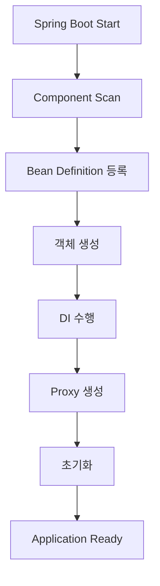
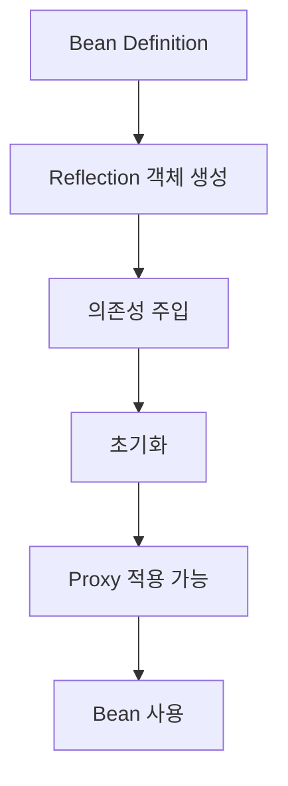
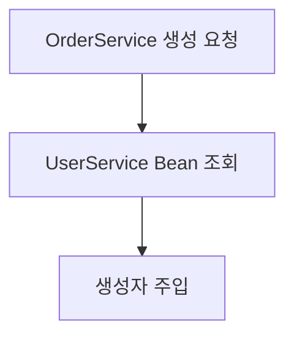
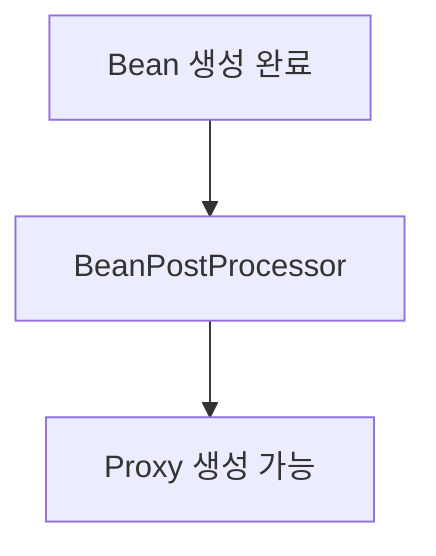
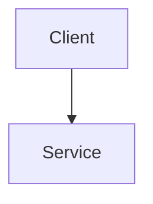
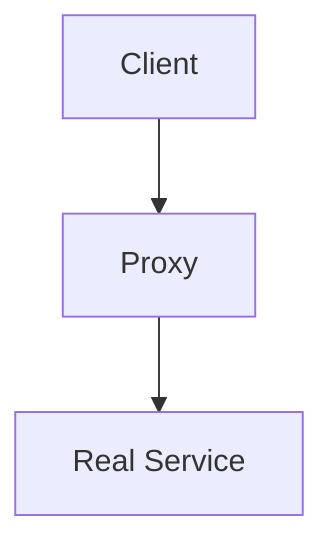
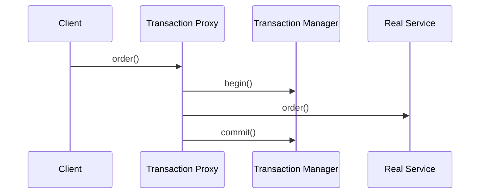
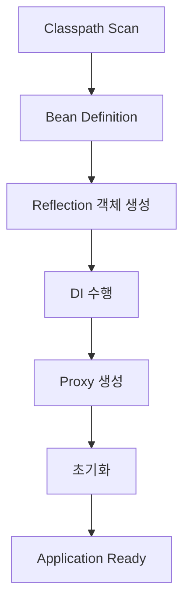

# Spring Bean Lifecycle Deep Dive

# 학습 목표

이번 주제의 핵심은 단순히:

> "Spring이 객체를 생성한다"

수준이 아니다.

실무에서는 반드시 아래를 설명할 수 있어야 한다.

- Spring Container는 정확히 무엇인가?
    
- Bean은 어떻게 생성되는가?
    
- DI는 언제 수행되는가?
    
- @PostConstruct는 왜 필요한가?
    
- Proxy는 언제 생성되는가?
    
- @Transactional은 어떻게 동작하는가?
    
- Singleton Bean은 왜 위험할 수 있는가?
    
- Spring Boot startup이 왜 느려지는가?
    

즉:

> Spring이 객체를 관리하는 전체 흐름

을 이해하는 것이 핵심이다.

---

# 먼저 가장 중요한 개념

Spring 핵심 철학은:

> "객체 생명주기를 개발자가 직접 관리하지 않는다"

이다.

일반 Java에서는:

```java
UserService service =
    new UserService();
```

직접 생성한다.

하지만 Spring에서는:

```java
@Service
public class UserService {
}
```

만 작성하면:

- 객체 생성
    
- 의존성 연결
    
- 초기화
    
- Proxy 생성
    
- 종료 관리
    

를 Spring이 대신 수행한다.

---

# Spring Container란?

Spring Container는:

> Bean 객체들을 생성하고 관리하는 공간

이다.

쉽게 말하면:

```text
객체 관리자
```

다.

---

# 흐름으로 보면



---

# 왜 이런 구조를 만들었을까?

핵심 이유는:

- 객체 생성 관리 자동화
    
- 의존성 관리 자동화
    
- 공통 기능 분리
    
- 유지보수 향상
    

이다.

---

# Bean이란?

Spring이 관리하는 객체.

예:

```java
@Service
public class UserService {
}
```

이 객체는:

```text
new UserService()
```

를 개발자가 직접 하지 않는다.

Spring이 대신 생성한다.

---

# Bean 생성 전체 흐름



---

# 1. Component Scan

Spring Boot 시작 시:

```java
@SpringBootApplication
```

기준으로 패키지 스캔 수행.

---

# 찾는 대상

대표적으로:

- @Component
    
- @Service
    
- @Repository
    
- @Controller
    
- @Configuration
    

---

# 왜 scan하는가?

개발자가 객체 등록을 일일이 안 해도 되게 하려고.

즉:

```text
자동 객체 등록
```

이다.

---

# 2. Bean Definition 생성

여기서 중요한 건:

> 아직 객체 생성이 아니다.

Bean Definition은:

```text
객체 생성 설계도
```

다.

포함 정보:

- 클래스 타입
    
- 생성자 정보
    
- Scope
    
- 의존성 정보
    

---

# 비유하면

```text
Bean Definition = 건축 설계도
Bean Instance = 실제 건물
```

이다.

---

# 3. 객체 생성 (Instantiate)

Spring은 Reflection 기반으로 객체 생성한다.

예:

```java
new UserService();
```

를 내부적으로 수행.

---

# 왜 Reflection을 사용할까?

Spring은 런타임에:

- Annotation 분석
    
- 동적 생성
    
- Proxy 생성
    

해야 한다.

즉:

> 런타임 유연성 확보

를 위해 Reflection 사용.

---

# Reflection이 느리다는 말은?

일반 호출보다 느린 건 맞다.

하지만 대부분 startup 구간에서 사용된다.

실제 운영 병목은 보통:

- DB
    
- Network
    

다.

---

# 4. DI (Dependency Injection)

의존 객체 주입 단계.

예:

```java
@Service
public class OrderService {

    private final UserService userService;

    public OrderService(
        UserService userService
    ) {
        this.userService = userService;
    }
}
```

---

# 내부 흐름



---

# 왜 DI를 사용하는가?

핵심:

> 객체 간 결합도를 낮추기 위해

다.

---

# 직접 생성 문제

```java
UserService userService =
    new UserService();
```

문제:

- 테스트 어려움
    
- 교체 어려움
    
- 강한 결합
    

---

# DI 장점

- 테스트 쉬움
    
- Mock 가능
    
- 유지보수 향상
    
- 유연성 증가
    

---

# 5. BeanPostProcessor

엄청 중요하다.

Spring 핵심 확장 포인트다.

---

# 여기서 하는 일

대표적으로:

- Proxy 생성
    
- AOP 적용
    
- @Transactional 처리
    
- Validation 처리
    

---

# 흐름



---

# Proxy란?

쉽게 말하면:

> 중간에서 대신 호출하는 객체

다.

---

# 원래 호출 구조



---

# Proxy 적용 후



---

# 왜 Proxy를 쓰는가?

비즈니스 로직 수정 없이:

- 로그
    
- 트랜잭션
    
- 보안
    
- 캐시
    

같은 공통 기능 추가 가능.

---

# @Transactional 실제 구조

```java
@Transactional
public void order() {
}
```

실제론:



---

# 핵심

> 트랜잭션 로직을 서비스 코드에 안 넣고 Proxy가 처리

한다.

---

# 6. @PostConstruct

초기화 로직 수행 시점.

```java
@PostConstruct
public void init() {
}
```

---

# 언제 호출되나?

DI 완료 이후.

즉:

```text
의존 객체 사용 가능한 상태
```

에서 호출된다.

---

# 실무 사용 사례

대표적으로:

- Cache preload
    
- 초기 데이터 로딩
    
- 설정 검증
    
- 외부 연결 확인
    

---

# 위험한 실수

@PostConstruct 내부에서:

- 대량 DB 조회
    
- 외부 API 호출
    

하면 startup 느려질 수 있다.

---

# 실제 운영 장애 사례

```text
MSA 서비스 startup 3분 이상
```

원인:

```text
@PostConstruct 내부 무거운 작업
```

---

# 7. Bean 사용

이후 실제 서비스 처리 수행.

---

# 8. Bean 종료

Spring 종료 시:

```java
@PreDestroy
public void destroy() {
}
```

호출.

---

# 왜 중요하냐?

정리 안 하면:

- DB Connection Leak
    
- Thread Leak
    
- Resource Leak
    

가능.

---

# Singleton Bean

Spring 기본 Scope는 Singleton이다.

즉:

```text
Application 전체에서 객체 1개
```

사용.

---

# 왜 Singleton 사용하는가?

장점:

- 메모리 절약
    
- 생성 비용 감소
    
- 관리 효율
    

---

# 위험한 이유

Singleton Bean 내부 mutable 상태 저장 시:

```java
private int count;
```

멀티 Thread 환경 문제 발생 가능.

---

# 실무 단골 장애

```text
동시 요청
→ count 꼬임
→ race condition
```

---

# Spring Boot startup이 느린 이유

대표 원인:

- Reflection
    
- Classpath Scan
    
- Proxy 생성
    
- Annotation 분석
    
- Bean 초기화
    

---

# Startup 전체 흐름



---

# Trade-off

## 장점

- 객체 관리 자동화
    
- 생산성 향상
    
- AOP 가능
    
- 확장성 우수
    

---

## 단점

- startup 비용 증가
    
- 내부 구조 복잡
    
- 디버깅 어려움
    
- reflection overhead
    

---

# 자주 발생하는 실수

## 1. Singleton Bean 상태 저장

멀티 Thread 문제 발생.

---

## 2. @PostConstruct 무거운 작업

startup latency 증가.

---

## 3. self invocation

@Transactional 내부 호출 문제.

---

## 4. 순환 참조

설계 문제 가능성 높음.

---

# 면접 꼬리 질문

## Q1. Spring Bean Lifecycle 흐름을 설명해보세요.

핵심:

- scan
    
- definition
    
- instantiate
    
- DI
    
- proxy
    
- init
    
- destroy
    

---

## Q2. Proxy는 언제 생성되나요?

핵심:

- BeanPostProcessor 단계
    

---

## Q3. Spring이 Reflection을 사용하는 이유는?

핵심:

- 런타임 유연성 확보
    

---

## Q4. Singleton Bean이 왜 위험할 수 있나요?

핵심:

- mutable state
    
- race condition
    

---

## Q5. Spring Boot startup이 느린 이유는?

핵심:

- scan
    
- reflection
    
- proxy 생성
    

---

# 좋은 답변 예시

> Spring은 Bean Lifecycle을 통해 객체 생성부터 의존성 주입, 초기화, Proxy 생성, 종료까지 관리합니다.  
> Spring은 Reflection 기반으로 런타임 객체를 생성하며 BeanPostProcessor 단계에서 AOP와 Transaction Proxy 같은 기능을 적용합니다.  
> 또한 Singleton Bean 기반이기 때문에 mutable 상태 관리에 주의해야 하며 startup 과정에서 scan과 proxy 생성 비용이 발생할 수 있습니다.

---

# 관련 CS 개념 연결

- Dependency Injection
    
- Inversion of Control
    
- Reflection
    
- Proxy Pattern
    
- Singleton Pattern
    
- Runtime Dynamic Loading
    
- Lifecycle Management
    

---

# 현업에서 특히 중요한 포인트

## 1. Spring은 Proxy 기반 Framework다

@Transactional 이해 핵심.

---

## 2. startup latency 중요

MSA 환경에서 매우 중요.

---

## 3. Singleton 상태 관리 중요

실무 장애 원인 자주 됨.

---

## 4. BeanPostProcessor 이해 중요

Spring 내부 구조 핵심.

---

# 핵심 요약

- Spring은 객체 생명주기를 Container가 관리한다
    
- Bean Definition → 생성 → DI → Proxy → 초기화 흐름으로 동작한다
    
- Spring 내부는 Reflection 기반이다
    
- Proxy를 통해 Transaction/AOP를 구현한다
    
- Singleton Bean 상태 관리는 매우 중요하다
    
- startup latency는 실제 운영 이슈다
    
- Bean Lifecycle 이해는 Spring 내부 구조 이해의 핵심이다